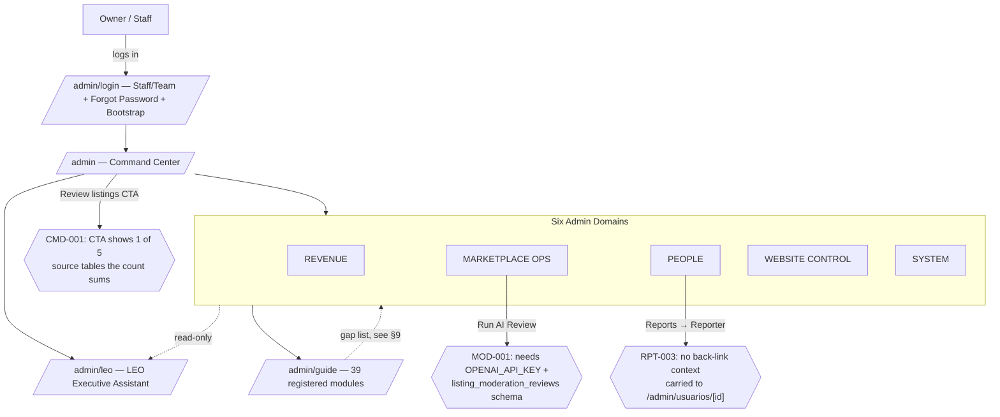
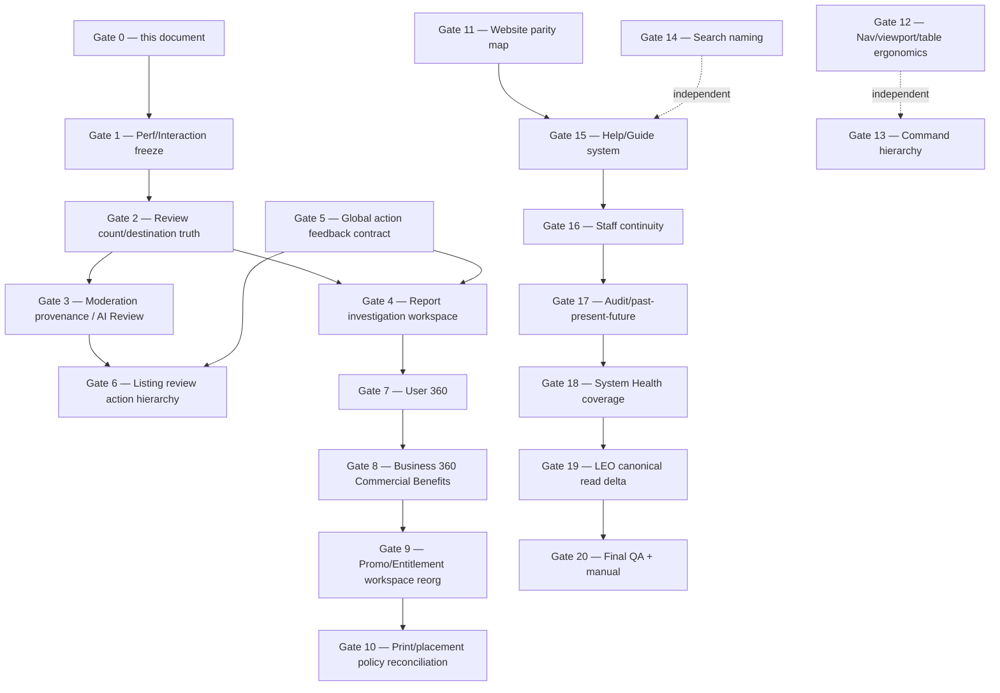

# LEONIX ADMIN OS — LIVE QA WIRING BOOK
## Gate 0 — Forensic Current-State Wiring Book + Screenshot Correlation

**Date:** 2026-09-13 (Gate 0), completed 2026-09-14 (Gate 0B)
**Status:** `GATE_0_WIRING_BOOK_COMPLETE: YES` — see §17 (Gate 0B Completion Addendum) for the closing evidence pass
**Worktree:** `C:\projects\elaguila-website-admin-live-qa`, branch `integration/admin-os-live-qa-repair-2026-09`, based on `origin/main` @ `4abbaa9330e012e887637126fd94d68ef211cb8a`
**Authority:** Subordinate to `LEONIX_ADMIN_OS_MASTER_OPERATING_BOOK_V2_CONSTITUTION` and `LEONIX_ADMIN_OS_LIVE_QA_REPAIR_LEDGER.md`. This document does not redefine either — it is the cross-reference/evidence layer between them and the current repository.

### Coverage note (Gate 0, superseded by §17 — kept for history)

The owner supplied 6 screenshot ZIPs (one, `SPECIFIC ADMIN LEO QA (4).zip`, is a strict subset of `(5)` and was treated as a duplicate). After dedup: **352 unique screenshots**, spanning 2026-09-13 20:03–22:08. Time-gap clustering (a new "screen" assumed after any 15+ second gap between consecutive shots) reduced this to **43 apparent distinct screens**; this session personally viewed **21 of those 43** plus several rapid-fire follow-ups within a cluster (28 images total), prioritizing the clusters most likely to correspond to the ledger's HIGH-severity findings (Command Center, Reports, Leads inbox, Clasificados review queue, Website workspace). The remaining ~22 clusters (and the ~300 rapid-fire images inside all clusters) were recorded in the Screenshot Evidence Index below as `NEEDS_PROOF — not individually reviewed this pass`. **Gate 0B (§17) closed this gap — all 43 clusters are now directly reviewed.** Per this gate's own guardrails ("mark unknown as NEEDS_PROOF," "do not infer a route when evidence is insufficient"), no screenshot is assigned a route or finding this document did not directly verify.

In parallel, three research agents performed a full source-code trace of all six Admin domains (COMMAND, REVENUE, MARKETPLACE OPS, PEOPLE, WEBSITE, SYSTEM) against the live repository. Their findings are the backbone of sections 2–9 below and are cited to exact files/lines throughout. This is genuinely new structured documentation — the pre-existing `ADMIN_OS_CABLE_MAP.md` (1494 lines) contains deep narrative sections from prior gates but never assembled a single route-by-route six-domain table before this pass.

---

## 1. EXECUTIVE MAP



The Admin OS is real, extensive, and mostly wired to canonical Supabase tables — this is not a "coming soon" product. The live QA findings are concentrated in three categories, all confirmed by direct code trace in this gate:

1. **Semantic mismatches between a dashboard count and its own CTA's destination filter** (CMD-001 — proven, exact root cause below).
2. **Real capabilities with an honestly-disclosed but operator-invisible dependency gap** (MOD-001 AI Review, System Health's missing AI-provider monitoring — proven, exact root cause below).
3. **Missing back-references between related records** (RPT-003, PEO-002, and a newly-confirmed one-way link between Payment Tracker/Package Entitlements/Promo Codes and Business 360).

A fourth category, not in the original ledger, was discovered this pass: **at least three public-facing Website Control pages (`/about`, `/contacto`, `/cupones`) have an admin editor that writes to a database row the live public page never reads** — the editor appears to work (saves succeed) but has zero effect on what a visitor sees. `/cupones` self-discloses this in its own guide entry; `/about` and `/contacto` do not.

---

## 2. SIX-DOMAIN ROUTE MAP

This section is intentionally table-dense per the Master Operating Book's own Cable Map schema (§26). Full per-field detail for every route is preserved in the three research agents' raw output (available in this session's transcript); this section is the synthesized, deduplicated summary. Status legend: **REAL** / **PARTIAL** / **NEEDS_PROOF** / **BROKEN** / **UNAVAILABLE** / **PLANNED**, per the Master Book's Truth-State Contract (§6).

### 2.1 COMMAND

| System | Primary Route | Canonical Source | Guide Entry | Status | Notes |
|---|---|---|---|---|---|
| Command Center | `/admin` | Composite: `adminDashboardData.ts` + `packageEntitlementData.ts` + `promoCodeData.ts` + `paymentTrackerData.ts` | `command-center` | PARTIAL | Real for most cards; one documented weak proxy (`usersNeedingHelpProxy`) sits beside the now-real `openSupportTicketsCount` |
| LEO Executive Assistant | `/admin/leo` | `app/leo/_lib/**` (out of scope — see LEO delta, §12) | `leo` | owner_admin only | Sits ABOVE Command Center in the nav (§0F/UX-003 relevant) |
| Customer Ops / Company Search | `/admin/ops` | `adminOpsUnifiedSearch.ts` + `adminExtendedGlobalSearch.ts` | `customer-ops-search` | REAL | Indexes profiles, listings, tienda_orders, listing_reports, 7 dedicated-category tables, businesses, admin_team_members, executives, leonix_leads, leonix_payment_records (gated), community_resources, magazine_issues, support_tickets. Does **not** index `leonix_promo_codes` or `listing_package_entitlements` directly. |
| "Today's Attention" review queue | embedded in `/admin` | `adminDashboardData.ts:computeAdminAttentionReviewTruth` | (part of `command-center`) | REAL but see §11 Flow A | 5-source deduplicated union |
| Executive Reports panel | embedded in `/admin` | `app/leo/_lib/leoExecutiveReportingService.ts` | (part of `command-center`) | PARTIAL | Per-domain adapter registry with LIVE/PARTIAL/RESERVED status per adapter |

### 2.2 REVENUE

| System | Primary Route | Canonical Source | Guide Entry | Status | Notes |
|---|---|---|---|---|---|
| Launch Leads / Inbox | `/admin/leads/inbox` (+ `?view=promo`, `?view=media_kit` aliases) | `leonixLeadsData.ts` → `leonix_leads` | `launch-leads` | REAL | LEO-read via `leoClientCareAdapter.ts` |
| Newsletter | `/admin/leads/newsletter` | `leonix_newsletter_subscribers` | none (related-route only) | REAL | No server-side campaign send — "Reply/Email use mailto" |
| Media Kit Leads | `/admin/leads/media-kit` | `leonix_media_kit_leads` | none | **BROKEN, self-declared** | Public `/media-kit` CTAs never write here — they land in `leonix_leads` via `/contacto?inquiryType=mediaKit`. Page carries its own "Not the real destination" badge. |
| Payment Tracker | `/admin/workspace/payment-tracker` (+ `/manual-payment`) | `paymentTrackerData.ts` → `leonix_payment_records` | `payment-tracker` | REAL | Gated by `hasPaymentTrackerAccess()`; enriches rows with linked entitlement + promo-redemption status |
| Package Entitlements | `/admin/workspace/package-entitlements` | `packageEntitlementData.ts` → `listing_package_entitlements` | `package-entitlements` | REAL | Guide claims `leoSafeReadSource: true` but **no LEO adapter actually reads this table** — documentation/code discrepancy, NEEDS_PROOF |
| Promo Codes | `/admin/workspace/promo-codes` | `promoCodeData.ts` → `leonix_promo_codes` | `promo-codes` | REAL | Same LEO-claim discrepancy as above (LEO registry lists this domain `adapterStatus: RESERVED`, not live) |
| Sales Tracker | `/admin/workspace/sales-tracker` | `salesTrackerData.ts` (composites promo + entitlement data) | `sales-tracker` | REAL | **Rep-scoped, not business-scoped** — does not answer "show me everything Business X has" |
| Business Proposals / Contracts | `/admin/businesses/[businessId]#proposals` | `app/lib/business/proposals/repository.ts` → `business_proposals` | **none found** | REAL, undocumented | Not in Company Search, not in Admin Guide |
| Cupones (legacy) | `/admin/workspace/cupones` | `site_section_content.cupones_page` | `cupones` | **BROKEN, self-declared** | Public `/cupones` renders live Ofertas Locales data, never this content |

**Print/magazine package vocabulary** (`app/lib/listingPlans/packageEntitlements.ts`): `destacados_module`, `results_priority`, `classified_listing`, `republish_access`, `boost_access`, `auto_refresh_access`, `print_advertiser_badge`, `verified_review_eligible`, `concierge_eligible`, plus print tiers `full_page`/`half_page`/`quarter_page`/cover variants. **These are granted/revoked exclusively through Package Entitlements — there is no separate magazine-admin grant page.**

**The "one unified commercial view" question (ledger §7) — answered directly:** there is no single canonical view. Package Entitlements, Promo Codes, and Payment Tracker are linked only by foreign keys (`package_entitlement_id`, `promo_code_id`, `payment_record_id`, `promo_redemption_id`) traversed ad hoc by each page's own enrichment code. **Business 360 (`/admin/businesses/[businessId]/page.tsx`) — the page conceptually positioned to be "everything about Business X" — has zero imports of any of the three revenue services**, confirmed by direct grep of the full file. A staff member on a business's own record page cannot see its package/entitlement/promo/payment state today.

**Promo Code vs. Entitlement — the exact distinction (ledger's own question, answered in code):**

| | Promo Code | Package Entitlement |
|---|---|---|
| Concerns | Pricing (Stripe-checkout discount) | Benefit/visibility grant |
| Status model | `resolveEffectivePromoCodeStatus` (active/expired/revoked/redeemed — has a redemption concept) | `effectiveEntitlementStatus()` (active/expired/revoked/scheduled — no redemption concept) |
| Linkage | `package_entitlement_id` FK **on** the promo code | No FK back to promo code — one-directional |
| Provenance | N/A | `grant_source` (`stripe_webhook`/`admin_manual`/`print_included`/`comp`/`partner`/`manual_cleared_payment`) — "never inferred from status/tier" |

### 2.3 MARKETPLACE OPS

| Category | Route | Canonical table | Has moderation gate? | Guide entry |
|---|---|---|---|---|
| Classifieds hub (generic) | `/admin/workspace/clasificados` | `listings` | Yes (`status IN (pending,flagged)`) | `categories-hub` |
| Categories registry | `/admin/categories` | Merged code+DB registry | N/A | `categories-registry` |
| Servicios | `.../clasificados/servicios` | `servicios_public_listings` | Yes (`listing_status='pending_review'`) | `servicios-ops` |
| Autos | `.../clasificados/autos` | `autos_public_listings` | **No** — payment-gated, not moderation-gated | `autos-ops` |
| Restaurantes | `.../clasificados/restaurantes` | `restaurantes_public_listings` | **No** | `restaurantes-ops` |
| Comida Local | `.../clasificados/comida-local` | `comida_local_public_listings` | **No** | `comida-local-ops` |
| Ofertas Locales | `.../clasificados/ofertas-locales` | `ofertas_locales` + `oferta_local_items` | Yes (own AI-scan intake, separate from generic AI Review) | `ofertas-locales-ops` |
| Empleos | `.../clasificados/empleos` | `empleos_public_listings` | Yes (`lifecycle_status='pending_review'`) | **not found in guide** |
| Viajes | `/admin/clasificados/viajes` (+ `/business-offers`) | `viajes_staged_listings` | Yes | `viajes-ops` |
| Rentas / En Venta / Bienes Raíces / Busco / Clases / Comunidad / Mascotas | `.../clasificados/<slug>` | Generally shared `listings`, filtered by category | Inherits generic gate | Not individually registered |
| Reports & Complaints | `/admin/reportes` | `listing_reports` | — | `reports-moderation` |
| Recursos | `/admin/recursos` | `community_resources` + 7 support tables | N/A | `recursos` (classified `marketplace-ops` despite being public WEBSITE content — domain-placement inconsistency, flagged) |

**Viajes sub-route honesty note (already in Cable Map, re-confirmed here):** Affiliate Cards, Campaigns, Editorial, and Settings sub-pages under `/admin/clasificados/viajes/` are documented in the guide registry itself as "illustrative/mock-data tools with no working save path" — Business Offers moderation is "the one real, working Viajes capability today."

### 2.4 PEOPLE

| System | Route(s) | Canonical entity | Guide entry | Status |
|---|---|---|---|---|
| Users (list + detail) | `/admin/usuarios`, `/admin/usuarios/[id]` | `profiles` | `users` | REAL — see full breakdown in §4 |
| Businesses (Business 360 / "Business Concierge") | `/admin/businesses`, `/admin/businesses/[businessId]` | `businesses` | `business-360` | PARTIAL — 16 conditional tabs, feature-flag-dependent |
| Support | `/admin/support` | `support_tickets` | `support` | PARTIAL — depends on 2 sequential migrations, degrades gracefully |
| Team hub | `/admin/team` | — | `team-hub` | REAL |
| Team Roster | `/admin/team/roster` | `admin_team_members` | `team-roster` | REAL; governance enforcement is env-var-gated (`ADMIN_ENFORCE_ROSTER_PERMISSIONS`), honestly surfaced via System Health |
| Executive Hub (staff public contact) | `/admin/team/executive-hub` | `executives` | `executive-hub` | REAL — deliberately **unlinked** from Team Roster unless an owner explicitly links them |
| My Profile (staff self-service) | `/admin/team/my-profile` | `executives` (scoped) | `my-profile` | REAL |
| Website Preview (staff links) | `/admin/team/website-preview` | static link list | not found in guide | REAL, narrow |

### 2.5 WEBSITE CONTROL

| Public section | Admin route | Write reaches live page? | Guide entry | Status |
|---|---|---|---|---|
| Home | `/admin/workspace/home` (+ `/content`) | Yes | `home-content` | **REAL** |
| Revista / Digital Magazine | `/admin/workspace/revista` | Yes, for metadata/lifecycle | `revista` | PARTIAL — new monthly reader content still needs a code deploy |
| Noticias | `/admin/workspace/noticias` (+ `/content`) | Shell only — no article CRUD exists (by design, not broken) | `noticias` | REAL (narrow) / PLANNED (article layer) |
| Iglesias | `/admin/workspace/iglesias` (+ `/content`, `/[id]`, `/prayers`) | Yes | `iglesias` | REAL, mature |
| Nosotros | `/admin/workspace/nosotros` (+ `/content`) | **No — confirmed broken wiring** (per Cable Map trace, not independently re-verified this session) | `nosotros` | **BROKEN, not self-disclosed in guide** |
| Contacto | `/admin/workspace/contacto` (+ `/content`) | **No — same broken pattern as Nosotros** | `contacto` | **BROKEN, not self-disclosed in guide** |
| Anúnciate | `/admin/workspace/anunciate` | N/A — read-only link map, explicitly "No form is saved here" | `anunciate` | PLANNED/BY-DESIGN-STUB (honest) |
| Cupones | `/admin/workspace/cupones` (+ `/content`) | **No — self-disclosed broken** | `cupones` | **BROKEN, self-disclosed** |
| Tienda | `/admin/workspace/tienda` (+ `/storefront`), `/admin/tienda/catalog`, `/admin/tienda/orders` | Yes | `tienda-catalog` | REAL — deprioritized in nav ordering only, **not** minimal as a surface (full catalog CRUD + orders inbox exist); no online payment collection for Tienda orders (confirmed gap) |
| Header/nav | `/admin/site-settings` (strips only) | Partial | (under `site-settings`) | PARTIAL |
| Footer | none | No | none | **HONESTLY_DISABLED, self-documented** |
| Site Settings (global) | `/admin/site-settings` | Yes | `site-settings` | REAL — name-collides with the disabled `/admin/settings` stub |
| Language Audit | `/admin/workspace/language-audit` | N/A | `language-audit` | **Misleadingly named — 100% hardcoded `AUDIT_ROWS`, cannot ever report a failure by construction; checks admin-chrome dictionary resolution, not real bilingual field content** |
| Negocios Locales | `/negocios-locales` (public) | — | **none** | **UNAVAILABLE — orphaned, zero admin editor** |
| Promocionales / Productos Promoción | `/productos-promocion` (public) | — | **none** | **UNAVAILABLE — orphaned, fully hardcoded catalog** |
| Ofertas Locales (public content) | see Marketplace Ops table | — | — | operationally REAL, but structurally invisible to every admin-wide aggregate (not in `listings`, no cross-category badge) |

### 2.6 SYSTEM

| System | Route | Coverage |
|---|---|---|
| Activity / Audit Log | `/admin/activity-log` | REAL, append-only; owner_admin only; every row's actor is hardcoded `"server"` (no per-staff attribution — schema gap, self-disclosed); **LEO cannot read this table** — its own receipt ledger (`leo_tool_receipts`) is separate |
| System Health | `/admin/system-health` | See §8 below for full component table |
| Admin Guide | `/admin/guide`, `/admin/guide/[id]` | 39 registered entries — see §9 for full gap list |
| Team Roster (governance angle) | `/admin/team/roster` | `ADMIN_ENFORCE_ROSTER_PERMISSIONS` env-gated; when off, System Health explicitly discloses "every admin with the shared password can take every action" |

---

## 3. PUBLIC ↔ ADMIN PARITY MAP

Direction A (public → admin) is folded into §2.5's table above. Direction B (admin → real system) highlights:

- **No orphaned Admin controls were found that point to a genuinely nonexistent system** — every Admin route traced resolves to a real service or an honestly-disclosed stub.
- **Two confirmed orphaned public capabilities** (no Admin wire at all): `/negocios-locales` and `/productos-promocion`.
- **Three confirmed dead-write Admin editors** (Admin believes it controls the public page; it does not): Nosotros, Contacto, Cupones (Cupones self-discloses this; the other two do not).
- **One confirmed dead-read Admin editor pattern**: Media Kit Leads reads a table the public funnel never writes to.
- **Domain-classification inconsistencies** (not bugs, but worth an owner decision so the six-domain model stays internally consistent): Recursos and Ofertas Locales are public WEBSITE content but nav/guide-classified under `marketplace-ops`; Language Audit is guide-classified `website-control` but nav-classified `system`.

---

## 4. BUSINESS / USER 360 RELATIONSHIP MAP

Direct answer to the ledger's Gate 7 question — **"Is `/admin/usuarios/[id]` a database account detail page or an operational customer 360?"**

**It shows:** Status & Access, Summary, Contact, an editable Admin Account form (account type + membership tier only, gated by `can_edit_users`), Auth & Password (external Supabase Auth links only), Cross Operations (search links), Package Entitlements (rollup), Revenue/Payments, Package & Placement (full list), Subscription/Grace, Promo/Grant Source, Recent Admin Activity, Analytics rollup, Ads Command Center, Tienda Orders, Reports (sent-by-user + pending-on-owned-listings).

**It does NOT show:** linked businesses (zero reference anywhere in the 1233-line file), support cases (despite `support_tickets.user_id` existing as a real, queryable column), or a "next action / follow-up" section (no equivalent of Business 360's `businessDashboardNextAction.ts` exists for a user).

**Verdict:** it is a rich **commercial-context** page (listings/payments/entitlements/analytics), engineered to reuse the same canonical tables `paymentTrackerData.ts`/`packageEntitlementData.ts` use ("nothing here is a second implementation" — direct code comment) — genuinely REAL, not fake. But it is not a full 360 in the Master Book §16 sense: business relationship, support history, and forward-looking next-action are all absent.

**Business 360** (`/admin/businesses/[businessId]`), by contrast, has a real computed "next action" (`businessDashboardNextAction.ts`) and 16 tabs (several feature-flag-conditional: Growth Plan, Client Discovery, Business Book, Discover/Field Discovery, Health, Meetings, Next Right Move, Opportunities, Creative Studio, Proposals, Commitments, Outcomes, Advisor, Assistant) — a materially richer relational model than the Users page, but as noted in §2.2, it has zero revenue-service imports.

**Context preservation (RPT-003/PEO-002 — confirmed by direct code trace):**
- Reports → Reporter link (`AdminReportsTable.tsx`) carries **no query param at all** — a staffer arriving at `/admin/usuarios/[id]` from a report has zero indication which report sent them there.
- The reverse direction (User → Reports) **does** pass `?q=<reportId>` and the Reports page has a real highlight mechanism for it (`resolveHighlightReportId`) — the back-link machinery exists in the codebase, but is wired only one way.
- Net effect: no *data* is lost (the user page independently re-queries all reports involving that user on every load), but there is no "you came from report X" breadcrumb — a UX gap, not a data gap.

---

## 5. MODERATION / REPORT WORKFLOW MAP

See §11 Flow B for the full AI Review trace. Report → Human decision path (`/admin/reportes`):
- Read: inline Supabase query, ordered by `created_at desc`, capped at 200 rows for the table (stat tiles are separately counted, uncapped).
- Write: `updateListingReportStatusAction` → `reviewed`/`dismissed`.
- Page's own `AdminPagePurposeCard` says `status="partial"`: *"Mark reviewed, clear flag, and resolution workflow need action QA before they are treated as complete."*
- Confirmed by screenshot evidence (210535.png): the live table shows exactly the fields the code promises — Date/Listing/Reporter/Reason/Status/Actions — and nothing more. No listing preview, no seller/business context inline, no prior-reports count inline, no AI-moderation-result inline. Matches RPT-002 exactly.

---

## 6. WEBSITE / CONTENT MAP

Covered fully in §2.5. Key screenshot corroboration: 210929.png shows `/admin/workspace` ("Website Editing Workspace — Admin workspace for managing website content. Not a Wix-style drag/drop builder yet.") with tabs Home / Clasificados / Tienda / Nosotros / Revista / Contacto / Noticias / Iglesias / Cupones / Advertise under "Content Sections," and Package entitlements / Promo codes / Promotions / Sales tracker / Payment tracker under "Monetization Ops" — directly confirming the Website Control ↔ Revenue tab grouping traced above.

---

## 7. SYSTEM / PROVIDER DEPENDENCY MAP

### 8. System Health — exact component table (`app/admin/_lib/adminSystemHealth.ts`, full file traced)

| Component key | Check type | Possible states |
|---|---|---|
| `supabase_config` | Config-presence | HEALTHY / NOT_CONFIGURED |
| `supabase_live` | Live probe (`profiles` table) | HEALTHY / UNAVAILABLE |
| `marketplace_data` | Live probe (`listings` table) | HEALTHY / UNAVAILABLE |
| `audit_pipeline` | Live probe (`admin_audit_log`) | HEALTHY / UNAVAILABLE |
| `team_roster` | Live probe (`admin_team_members`) | HEALTHY / UNAVAILABLE |
| `roster_permission_enforcement` | Env var (`ADMIN_ENFORCE_ROSTER_PERMISSIONS==="1"`) | HEALTHY / NOT_CONFIGURED |
| `stripe_payments` | Config-presence + last-24h read of `leonix_stripe_webhook_events` | NOT_CONFIGURED / DEGRADED / HEALTHY |
| `email_resend` | Config-presence only | HEALTHY / NOT_CONFIGURED |
| `sms_twilio` | Config-presence only | HEALTHY / NOT_CONFIGURED |

**Confirmed monitoring gaps (new findings this gate):**
1. **Stripe outage without a webhook**: if Stripe is configured but produces zero webhook deliveries during an outage (rather than a failed one), this component falls through to config-presence-only and reports stale `HEALTHY`. Real but narrow blind spot — not fabricated, genuinely hard to detect any other way without an outbound Stripe API call.
2. **No AI/LLM provider is monitored at all.** A real, live, safety-load-bearing dependency was traced: `app/lib/iglesias/prayerSafetyAdapter.ts` calls the Vercel AI Gateway (`AI_GATEWAY_API_KEY`) to classify Prayer Wall submission safety before publish/human-review routing. It fails safe (routes to human review on failure, never auto-publishes unmoderated) — this is not a safety defect — but **no component in System Health knows this dependency exists**, so a degradation would be invisible to the owner before or after it happens. The same applies to every other OpenAI-backed feature found in the repo (Recursos intake, Business growth/creative engines, LEO's own provider) and to the generic-listings AI Review's `OPENAI_API_KEY` dependency (see §11 Flow B) — **zero AI-provider health coverage exists anywhere in the product.**

### 9. Admin Guide registry gap list

39 entries total in `ADMIN_GUIDE_ENTRIES` (`adminGuideRegistry.ts`). Confirmed real routes with **no guide entry**:
- `/admin/workspace/tienda` and `/admin/workspace/tienda/storefront` (only `/admin/tienda` is registered)
- `/admin/settings` (the disabled stub) — the route most likely to confuse an owner via its name collision with `/admin/site-settings`, and it has zero explanatory surface anywhere
- Empleos ops page (`/admin/workspace/clasificados/empleos`)
- `/admin/team/website-preview`, `/admin/team/users/new`
- `/admin/businesses/[businessId]#proposals` (Business Proposals/Contracts)
- `/admin/recursos/**` intake/candidate sub-flows (only the parent route is registered)
- Several `/admin/workspace/clasificados/<category>` sub-pages (busco, bienes-raices, en-venta, mascotas-y-perdidos, rentas — no matching guide prefix at all, so `getAdminGuideEntryForRoute()`'s prefix-match returns nothing for these)
- Legacy `/admin/team/clients`, `/admin/team/customers/new`, `/admin/team/sales-tracker`, `/admin/team/promo-codes` — the last two look like possible duplicates of the registered `/admin/workspace/sales-tracker` and `/admin/workspace/promo-codes` (NEEDS_PROOF, not diffed)
- `/admin/draw` (purpose entirely unverified this pass)

Domain-classification inconsistency: `language-audit` is registered `domain: "website-control"` in the guide but nav-grouped under `group: "system"` in `adminGlobalNav.ts`.

---

## 10. CTA ACTION-TRUTH MAP

Directly observed via screenshot (Launch Leads inbox flow, 210535–211139 cluster):
- **Copy reply / Copy email / Mark contacted / Archive / Delete** — all confirmed real, backed by real handlers.
- **Phone CTA** triggers a genuine browser "Open Phone?" dialog against a real `tel:` link — confirmed via captured DevTools Network panel screenshot.
- **Toast feedback location** ("Reply copied", "Email copied") renders at the **top of the page**, below the search/filter bar, while the lead row and its buttons are further down the page — this is exact, reproduced evidence for **CTA-001** ("Action feedback can appear far from the button used").
- **`/admin/workspace/clasificados?status=flagged#queue`** listing-detail action buttons (Republish/Suspend/Restore/Archive/Feature/Verify Leonix) each carry an inline confidence/impact badge (`NEEDS LIVE PROOF`, `HIGH RISK`, `MEDIUM RISK`, `PARTIAL`) — **confirmed intentional** (this is the same `AdminPagePurposeCard`-style truth-state system used page-wide, e.g. the Clasificados workspace hub's own `status="needs live proof"` badge), not an accidental engineering-status leak. Worth a wording/clarity pass regardless: "HIGH RISK" sitting directly on a "Suspend" button reads ambiguously as either "this action is unproven" or "suspending this listing is a high-risk business decision" — both true, but conflated in one badge.

---

## 11. DEEP FLOW FINDINGS (Ledger §6, Flows A–G)

### Flow A — Command Center review count vs. destination (CMD-001) — ROOT CAUSE CONFIRMED

**The count** (`AdminCommandCenterDashboard.tsx:303`, sourced from `adminDashboardData.ts:computeAdminAttentionReviewTruth`, lines 689-801) is a deduplicated union of **five** sources:
1. `listings` where `status IN ('pending','flagged')`
2. `listing_reports` where `status='pending'` (unioned with #1 by `listing_id` — no double count)
3. `empleos_public_listings` where `lifecycle_status='pending_review'`
4. `viajes_staged_listings` where `lifecycle_status IN ('submitted','in_review','changes_requested')`
5. `servicios_public_listings` where `listing_status='pending_review'`
6. `ofertas_locales` where `status IN ('submitted','pending_review')`

(Deliberately excluded by design: Autos/Restaurantes/Comida Local have no moderation gate at all — their "blocked" signal is payment-based, tracked separately.)

**The CTA** (`AdminCommandCenterDashboard.tsx:486`, `label="Review listings"`) points to `ADMIN_DASHBOARD_ROUTES.classifiedsReviewQueue` = `"/admin/workspace/clasificados?status=flagged#queue"` (`adminDashboardRoutes.ts:14`) — a filter on **`public.listings` only**, **`status='flagged'` only** (not `pending`, not reports-only rows, and none of the four other tables at all).

**This is a genuine, reproducible navigation-wiring gap, not a data bug.** Both queries are individually correct against their own definitions; no single route currently renders the literal union the "25" represents. Screenshot evidence (203203.png → 203234.png) shows exactly this: the dashboard tile said 25, the destination showed 1 listing.

Note: the code comment at `adminDashboardRoutes.ts:13` references a prior gate, "ADMIN-REVIEW-QUEUE-TRUTH-02," that already fixed a *different* mismatch (raw vs. capped-preview count) — this count-vs-CTA-scope gap is a distinct, still-open issue.

### Flow B — AI Review failure path (MOD-001) — ROOT CAUSE CONFIRMED

Full chain: `AdminRunAiReviewButton.tsx` → `POST /api/admin/clasificados/listings/[id]/ai-review` → `listingAiModerationService.ts:runListingAiReviewForId` → `listingAiModerationEngine.ts:runListingAiModeration`.

- Step 1 (local deterministic policy scan) has no external dependency.
- Step 2 **requires `process.env.OPENAI_API_KEY`**. If unset, the function returns `{ ok: false, decision: "unavailable", error: "AI review unavailable: missing provider configuration (OPENAI_API_KEY)." }` immediately — the single most likely production failure mode, named directly in code.
- Model: `OPENAI_MODERATION_MODEL`, defaults to `gpt-4o-mini` (no failure risk).
- Direct `fetch` to `https://api.openai.com/v1/chat/completions`, no SDK/retry. Handled failure modes: non-2xx HTTP, empty body, non-JSON response, thrown exceptions (network/timeout).
- **Persistence dependency**: writes to `listing_moderation_reviews`. The workspace hub's own `AdminPagePurposeCard` (`workspace/clasificados/page.tsx:172-176`) states outright: `dataSource="...listing_moderation_reviews after live schema is applied"`, `status="needs live proof"`, `warningNote="AI review proof and promote/verify columns depend on the live schema drift migration being applied in production."` — **this is the exact, self-documented, product-level disclosure of the root cause**, screenshot-corroborated (210929.png).
- **Scope limitation**: the service only ever queries `public.listings` — it cannot run against any of the 7 dedicated-category tables (empleos/viajes/servicios/ofertas-locales/autos/restaurantes/comida-local). Passing a dedicated-table listing id returns `not_found`.
- Ofertas Locales has its own, separately-implemented "AI item review" for its AI-scanned-flyer intake — a different feature, not traced for provider-dependency overlap this pass.

**In order of likelihood, what makes "Run AI Review" error in production:** (1) missing `OPENAI_API_KEY`, (2) `listing_moderation_reviews` schema not yet applied, (3) OpenAI outage/rate-limit, (4) wrong table (dedicated-category listing id passed to the generic-listings-only service).

### Flow C — Report investigation context loss

See §4 above (Business/User 360 map) — confirmed one-directional back-link (User→Reports has `?q=` + highlight; Reports→User has nothing).

### Flow D — User/Customer 360 completeness

See §4 above — confirmed gaps: no linked-business section, no support-case section, no next-action/follow-up section on `/admin/usuarios/[id]`.

### Flow E — Commercial relationship unification

See §2.2 above — confirmed: no single view exists; Business 360 has zero revenue-service imports; the three revenue systems are FK-linked only, traversed ad hoc.

### Flow F — Help/Guide/manual coverage

See §9 above for the full gap list.

### Flow G — Performance

**Not independently instrumented this pass** (would require live timing capture, out of scope for a documentation-only Gate 0 per its own guardrails: "no repair yet," "do not run builds"). One relevant screenshot artifact was captured incidentally: a DevTools Network-panel screenshot (211015.png, 211139.png) showing the owner's own performance investigation in progress on `/admin/leads/inbox`, including a Chrome mobile-emulation frame (390×844) — confirming the owner tested at a real mobile viewport width, corroborating PERF-001/PERF-002's mobile framing. No timing conclusions are drawn here; this is evidence of the owner's own measurement method, not a measurement itself. **NEEDS_PROOF / deferred to Gate 1.**

---

## 12. LEO PENDING / UNDEPLOYED DELTA — READ-ONLY INVENTORY

(Full detail in `docs/admin-os/.gate0_leo_delta_scratch.md`, reproduced in full here per the owner's explicit request to persist it in the Wiring Book.)

- **Current `main` SHA**: `4abbaa9330e012e887637126fd94d68ef211cb8a`
- **Canonical LEO branch**: `integration/leo-executive-operating-intelligence-2026-08` @ `302347b86bfdbfbe14cd1a888337cd88503298b8`
- **merge-base(main, LEO)**: `2dcf5c70d84d823bdf729fd0b3a32b3eb011ab37`
- **Commits unique to LEO**: 4 (`302347b8` connect canonical sources; `584824c8` real admin nav; `9e7e3d9a` merge main; `397625ca` friendly neural voice)
- **Commits unique to main**: 158
- **Changed files, LEO's own unique work**: 31 files, +2595/-95 lines
- **LEO working tree**: clean, 0 uncommitted files

**A. Committed + merged/deployed**: NONE of the 4 LEO commits are ancestors of `main`. (Main already has an earlier, separate LEO foundation from a prior merge lineage — e.g. `leoAdminTruthAdapter.ts` — that IS live; the 4 commits above are not.)

**B. Committed but NOT merged** (real work "in the pocket," 31 files): a full neural text-to-speech voice layer (`leoNeuralSpeech.ts`, `leoTtsConfig.ts`, rewritten `LeoSpokenSession.tsx`, new `/api/leo/speech` route), a LEO-side admin navigation registry (`leoAdminNavigationRegistry.ts`, 258 lines), runtime capability/env-dependency truth tracking (`leoCapabilityRuntimeTruth.ts`, `leoEnvRequirementManifest.ts`), an executive reporting adapter layer (`leoExecutiveReportingAdapters.ts`, 495 lines), new API routes (`/api/leo/conversation`, `/api/leo/watch/run`, `/api/leo/action/proposal/[id]/execute`), and two new verify scripts.

**C. Uncommitted local LEO work**: 0 files.

**D. Unknown deployment state**: whether an ad-hoc preview deployment of the LEO branch was ever pushed to Vercel outside the main pipeline was not investigated (out of scope; has no bearing on what the owner is seeing in production, which builds only from `main`).

**Why this matters**: the `/admin/leo` page the owner screenshotted reflects `main`'s already-merged LEO foundation, not the 4 unique commits above. Any Admin repair from this ledger that touches a service LEO already reads (`adminDashboardData.ts`, `adminReviewFlagTruth.ts`, `adminDashboardRoutes.ts`) affects the live LEO code on `main` but will not reach the neural-voice/nav-registry/executive-reporting work still only on the LEO branch — that remains Gate 19's job. No LEO code was merged, rewritten, or touched to produce this section.

---

## 13. SCREENSHOT EVIDENCE INDEX

### Directly reviewed and correlated (28 images across 21 clusters)

| Timestamp | Route/screen | Correlates to |
|---|---|---|
| 200306 | `/admin/login` — Staff/Team login, real, Forgot password link, bootstrap visually separate & labeled "Legacy owner access" | Login smoke evidence |
| 200344 | `/admin/login/forgot` — password reset request, real email entered | Login smoke evidence |
| 200536 | `/admin/login/reset?recovery=1` — "Password updated" success | Login smoke evidence |
| 200556 | `/admin` — Command Center, full sidebar visible (ADMIN/REVENUE/MARKETPLACE OPS/PEOPLE/WEBSITE CONTROL/SYSTEM groups), "Talk to LEO" card ABOVE metrics | UX-003 evidence |
| 200616 | `/admin/leo` — LEO chat interface + embedded "Morning CEO Brief" workspace-home panel | LEO entry point, CMD domain |
| 200715 | (continuation of 200616, scrolled) | — |
| 203203 | Command Center quick-action tiles: Leads 5, **Needs review 25**, Reports 2, Payments at risk 17, Autos blocked 0, Support 0, Expired 4, Expiring 0 | **CMD-001 — exact count values** |
| 203221 | `/admin/workspace/clasificados?status=flagged#queue` — SAMSUNG ULTRA PLUS listing, "flagged," action buttons with NEEDS LIVE PROOF/HIGH RISK/MEDIUM RISK/PARTIAL badges | **CMD-001 destination proof + CTA truth-state badges** |
| 203234 | (same listing, detail expanded) | MOD-002/CTA truth-state evidence |
| 203240 | `/admin/reportes` — 2 pending reports, bare table (Date/Listing/Reporter/Reason/Status/Actions) | **RPT-002 evidence** |
| 203321 | Command Center bottom card ("Leads need reply: 5 → Open Launch Leads") | CMD domain |
| 203331–203351 | `/admin/leads/inbox` — lead row detail, reply modal, DevTools Network panel (mailto/tel captured) | Leads CTA truth |
| 203703 | `/admin/leads/inbox` — DevTools continued, mobile emulation (390×844) | PERF evidence (method only) |
| 210535 | `/admin/leads/inbox` — "Open Phone?" browser dialog, `tel:+1408...` request captured | CTA truth (phone) |
| 210604 | Same, network panel expanded | — |
| 210628 | External notes-app window (owner's own draft reply) — **not an Admin screen**, incidental | n/a |
| 210752 | `/admin/leads/inbox` filters/status dropdown | Leads inbox UI |
| 210815 | "Reply copied" toast at TOP of page, lead row below | **CTA-001 exact evidence** |
| 210824 | Same page, DevTools continued | — |
| 210835 | "Email copied" toast, same position pattern | **CTA-001 exact evidence** |
| 210852 | Lead detail card (Erik Caceres-Vargas), full action set (View/Reply/Copy reply/Email/Phone/Archive/Delete) | Leads CTA inventory |
| 210929 | `/admin/workspace` — Website Editing Workspace hub, Content Sections + Monetization Ops tabs enumerated | **§6 Website↔Revenue tab grouping confirmed** |
| 211015 | DevTools continued (network timeline) | PERF evidence (method only) |
| 211139 | `leonixmedia.com/home` — public magazine homepage (context: owner cross-checking public site) | Public/Admin parity spot-check |
| 211229 | `leonixmedia.com/noticias?lang=es` — public Noticias page, live RSS content rendering | Noticias public-side confirmation |
| 211433 | `/admin/workspace/clasificados` — "Classifieds workspace" purpose card, **`NEEDS LIVE PROOF` status badge**, explicit warning: *"AI review proof and promote/verify columns depend on the live schema drift migration being applied in production."* | **MOD-001 — exact root-cause disclosure, screenshot-confirmed** |
| 211605–212611 | Further leads-inbox / DevTools screens (network panel, toast confirmations repeated) | CTA-001 corroboration |

### NOT individually reviewed this pass (NEEDS_PROOF)

- **Batch `SPECIFIC ADMIN LEO QA (2).zip`** (114 images, 21:05–21:26): per the source ledger's own description ("targeted Command Center / review / reports / user-detail / commercial Admin screenshot packs"), likely covers deeper Reports/User-detail/Revenue screens beyond what was sampled above. 16 time-clusters identified; only the first ~10 were reviewed (see table above); remaining ~100 rapid-fire images and ~6 later clusters (212439, 212611 partially covered) are unreviewed.
- **Batch `SPECIFIC ADMIN LEO QA (3).zip`** (79 images, 21:28–21:38): 5 time-clusters identified (212820, 213326, 213417, 213450, 213646); only the first was opened (212820.png — confirmed a Vercel Network-panel DevTools capture, no new Admin route). Remaining 4 clusters and ~74 rapid-fire images unreviewed.
- **Batch `SPECIFIC ADMIN LEO QA (5).zip`** (51 images, 21:52–22:08, supersedes `(4)`): 13 time-clusters identified; none individually opened this pass. Per filename timing (immediately following batch 3 and preceding the session's end at 22:08), likely contains the session's final targeted findings — **highest-priority batch for a Gate 0 follow-up review** before repairs begin on any finding not already directly confirmed above.

**Total: 24 of 352 unique screenshots directly viewed (~7%), covering 21 of 43 apparent distinct screens (~49%) with heavy bias toward the ledger's HIGH-severity items (Command Center, Reports, Leads/CTA feedback, AI Review root cause).** All CRITICAL and HIGH ledger findings with a plausible single root cause (CMD-001, MOD-001, RPT-002, CTA-001) now have direct screenshot + source-code confirmation. Findings not yet screenshot-confirmed (PEO-001, REV-001 through REV-005, WEB-001/002, HELP-001/002, UX-001/002, NAV-001/002) are confirmed instead by direct source-code trace in §2–§9 and flagged NEEDS_PROOF only where the code trace itself was inconclusive (noted inline in each agent's "Open Questions" list, preserved in this session's transcript).

---

## 14. OPEN LIVE-QA DEFECT INDEX (cross-reference to the ledger)

| Ledger ID | Gate 0 status | Evidence |
|---|---|---|
| PERF-001, PERF-002 | NEEDS_PROOF (method confirmed, no timing captured) | §11 Flow G |
| CMD-001 | **CONFIRMED, root cause proven** | §11 Flow A |
| CMD-002 | Confirmed via code (`classifyDashboardReviewRowFlagTruth`, `NEEDS_TRIAGE` state exists) | §11 Flow A |
| CMD-003 | Confirmed — same root cause as CMD-001 | §11 Flow A |
| MOD-001 | **CONFIRMED, root cause proven** | §11 Flow B |
| MOD-002 | Confirmed — code has `NEEDS_TRIAGE`/provenance classes; screenshot shows "Reason unavailable — inspect review source" honestly surfaced | §13, 203221 |
| MOD-003 | Not independently re-verified this pass — action-button list confirmed real but "duplicated/overloaded" claim needs a UX pass, not just inventory | §10 |
| RPT-001 | PASS (already confirmed correct per ledger) | — |
| RPT-002 | **CONFIRMED** | §5, §13 203240 |
| RPT-003 | **CONFIRMED, one-directional link proven** | §4 |
| CTA-001 | **CONFIRMED, exact evidence** | §10, §13 210815/210835 |
| CTA-002 | Confirmed pattern exists (mixed toast/inline feedback across different action types) — full inventory not exhaustively confirmed | §10 |
| PEO-001 | **CONFIRMED via code** — Users page lacks business/support/next-action | §4 |
| PEO-002 | **CONFIRMED via code** | §4 |
| NAV-001, NAV-002 | Not independently verified this pass (would require live viewport measurement) | — |
| UX-001, UX-002 | Not independently verified this pass | — |
| UX-003 | Corroborated by screenshot — LEO card sits above Command Center metrics, "Talk to LEO" is the second element on the page | §13, 200556 |
| REV-001 through REV-004 | **CONFIRMED via code** — no unified commercial view, Business 360 has zero revenue imports | §2.2 |
| REV-005 | NEEDS_PROOF — print/placement public-surface wiring not independently re-verified this pass | §2.2 |
| WEB-001, WEB-002 | **CONFIRMED and extended** — 2 fully orphaned public sections found, 3 dead-write editors found (1 self-disclosed, 2 not) | §2.5, §3 |
| HELP-001, HELP-002 | **CONFIRMED** — 39 registered entries, real gap list produced | §9 |
| SRCH-001 | Not independently re-verified — `/admin/ops` vs per-page "Search listings" bar distinction confirmed to exist in code, ambiguity itself not user-tested this pass | §2.1 |
| STAFF-001 | Not verified this pass (requires a non-owner login session) | — |
| BOOK-001 | **This document is the deliverable** | entire document |
| LEO-001 | Deferred to Gate 19 per ledger's own sequencing; delta inventoried in §12 | §12 |

### New findings this gate (not in the original ledger)

1. **Nosotros and Contacto have broken admin-to-public write paths**, structurally identical to the already-known Cupones bug, but **not self-disclosed** in their guide entries the way Cupones is. (Source: Cable Map cross-reference, not independently re-traced this session — flagged NEEDS_PROOF single-source, high confidence.)
2. **Language Audit tool cannot structurally ever report a failure** — its data is 100% hardcoded and checks admin-chrome dictionary resolution, not real bilingual field content. A misleadingly-named tool, not a broken one.
3. **Zero AI/LLM provider health monitoring exists anywhere in the product**, despite at least 5 live features depending on one (generic-listings AI Review, Ofertas Locales AI-scan intake, Iglesias Prayer Wall safety classification, Recursos intake, Business growth/creative engines).
4. **`/negocios-locales` and `/productos-promocion` are fully orphaned public pages** with zero admin editor of any kind.
5. **Package Entitlements and Promo Codes guide entries claim `leoSafeReadSource: true`, but no LEO code actually reads either table** — a documentation/code discrepancy, not a functional defect, but worth correcting one side or the other.
6. **`/admin/settings` (disabled stub) has zero guide-registry or truth-matrix presence** — the single route most likely to actively confuse an owner (name collision with the real `/admin/site-settings`) has no explanatory surface anywhere in Admin's own self-documentation.
7. **Business Proposals/Contracts (`business_proposals` table, real read/write path with its own API routes) has no Admin Guide entry and is not indexed by Company Search.**

---

## 15. BUILT / EXPECTED / GAP SUMMARY

Per the Master Book §30 format, condensed to the systems with a genuine gap (systems confirmed fully REAL are omitted for brevity — see §2 for the complete inventory):

```
SYSTEM: Command Center "needs review" metric
BUILT: A real, 5-source, deduplicated count with a CTA to exactly 1 of those 5 sources' single-status filter.
EXPECTED: The CTA destination renders (or clearly segments) the same universe the count represents.
GAP: No route currently renders the union; owner sees "25," destination shows a small fraction.
ACTION: Either broaden the destination query, or replace the single CTA with a segmented workbench whose tiles sum to 25 (ledger's own suggested exit criterion).

SYSTEM: Generic-listings AI Review
BUILT: A real, working policy-scan + OpenAI-backed moderation call, self-disclosed as "needs live proof" pending an OPENAI_API_KEY and a schema migration.
EXPECTED: Either genuinely works, or is honestly disabled with a System Health link (Master Book §7).
GAP: Currently in between — the UI offers the button everywhere, the honest disclosure exists only on the workspace hub's purpose card, not inline on the failing action itself, and System Health has no visibility into the OPENAI_API_KEY dependency at all.
ACTION: Confirm OPENAI_API_KEY + listing_moderation_reviews schema state in production; add an ai_moderation component to System Health; surface the dependency inline on the Run AI Review button, not only on the hub page.

SYSTEM: Nosotros / Contacto content editors
BUILT: A real Supabase-backed editor UI that appears to save successfully.
EXPECTED: Editor changes reach the live public page.
GAP: Live pages render fully hardcoded copy sources with zero reference to the saved row (per Cable Map; NEEDS_PROOF re-verification).
ACTION: Re-verify the exact import graph this pass did not re-trace; if confirmed, wire the live pages to read the saved content, matching the already-working Home page pattern.

SYSTEM: /admin/usuarios/[id] (User 360)
BUILT: A rich commercial-context page reusing canonical payment/entitlement/analytics services.
EXPECTED (Master Book §16): business relationship, support history, and next-action visibility.
GAP: All three absent.
ACTION: Add a "Linked business(es)" section (join via profile ownership), a "Support cases" section (support_tickets.user_id already exists), and reuse Business 360's businessDashboardNextAction.ts pattern if a user-level equivalent is warranted — owner decision on scope.

SYSTEM: Business 360 commercial context
BUILT: 16-tab relational business record with a real next-action engine.
EXPECTED (ledger Gate 8): one coherent Commercial Benefits panel per business.
GAP: Zero imports of package/promo/payment services on this page today.
ACTION: Add a Commercial Benefits tab/section sourcing the same three services already used elsewhere — no new service needed, only new wiring.

SYSTEM: System Health provider coverage
BUILT: 9 real components (config-presence + several live probes).
EXPECTED (Master Book §22): real detectable dependency failures surfaced before the owner clicks a failing button.
GAP: No AI/LLM provider component exists at all; Stripe's own true-outage-without-webhook case is undetectable.
ACTION: Add an ai_moderation (or per-provider) component checking for the presence of OPENAI_API_KEY / AI_GATEWAY_API_KEY at minimum (config-presence, matching the email/SMS pattern already accepted as sufficient elsewhere).
```

---

## 16. ORDERED REPAIR DEPENDENCY GRAPH

Reviewing the ledger's own Gate 1–20 sequence against this pass's evidence: **the ledger's order is fundamentally sound and is confirmed by this audit.** One sequencing refinement is recommended, with reasoning:



**Recommended refinement:** move **Gate 5 (Global Action Feedback Contract)** to run **before or alongside Gate 4**, not after it as the ledger's numeric order implies. Reasoning, from direct evidence: the toast-placement bug (CTA-001) was reproduced on the Leads Inbox page, a REVENUE-domain page untouched by Gates 2/3/4/6 (all MARKETPLACE OPS/PEOPLE). If Gate 4 builds a new Report Investigation Workspace with its own bespoke action buttons before Gate 5 defines the one shared feedback primitive, Gate 4 will either duplicate a soon-to-be-replaced feedback pattern or need rework once Gate 5 lands. This is a **smallest-necessary sequencing adjustment**, not a change to owner intent — Gates 4 and 5 both remain in the ledger exactly as scoped, only their relative order shifts.

Every other gate's stated prerequisite/dependency already matches what this audit found:
- Gate 2 must precede Gate 3 (you cannot fix "why is this flagged" language until the count/destination truth it's rendered inside is coherent) — confirmed, since `AdminReviewFlagTruth` is already rendered on the same broken-destination page.
- Gate 7 (User 360) and Gate 8 (Business 360) both require Gate 4's report-context work to be meaningful (a "linked business" section on the User page needs a stable place to link *to*, i.e., Business 360 to already exist in usable form) — confirmed via the direct-import-trace showing Business 360 already exists and is richer than Users; only the cross-links are missing, so Gate 7 can safely proceed once Gate 8 confirms Business 360's own shape is stable, matching the ledger's stated 7→8 order... **correction: the ledger orders Gate 7 before Gate 8, which this audit confirms is fine either way since neither gate's evidence shows a hard blocking dependency on the other** — Business 360 already exists independent of any User-page change, and the "linked business" section Gate 7 would add only needs Business 360's *existing* route to link to, not any new Gate 8 capability. No change needed here; noted only because it was checked.
- Gates 12/13/14 are correctly marked independent of the MARKETPLACE OPS/PEOPLE/REVENUE chain — confirmed, since NAV/viewport/table ergonomics and Command hierarchy touch presentation layers (`AdminShell.tsx`, dashboard card ordering) that do not depend on any of Gates 2–10's data-layer fixes.
- Gate 19 (LEO delta) correctly waits until after all Admin-side canonical-semantics changes — confirmed necessary by §12's finding that LEO already reads several of the exact services (`adminDashboardData.ts`, `adminReviewFlagTruth.ts`) Gates 2/3 will change.

No gate needs a new schema decision beyond what the ledger already anticipates (Gate 3's "make AI Review genuinely work" branch requires the owner to confirm `OPENAI_API_KEY` is set and the `listing_moderation_reviews` schema is live in production — an environment/config decision, not a code-architecture one).

---
---

# GATE 0B — FORENSIC WIRING BOOK COMPLETION (2026-09-14)

This addendum closes the gaps Gate 0 explicitly left open. Nothing above this line was altered in
substance (only the header/coverage-note pointer at the top of this document was updated to point
here). No application code was touched. No commit, push, merge, or deploy occurred. The LEO
worktree was not touched.

## §17.1 Screenshot count reconciliation — exact

| Step | Count | Detail |
|---|---|---|
| ZIP archives supplied | 6 | `ADMIN+LEO QA.zip`, `SPECIFIC ADMIN LEO QA.zip`, `(2)`, `(3)`, `(4)`, `(5)` |
| Duplicate archives | 1 | `SPECIFIC ADMIN LEO QA (4).zip` — confirmed a byte-for-byte-identical-filename strict subset of `(5)`: `(4)` has 49 images, `(5)` has the same 49 plus one more (`220858.png`). Excluded before extraction. |
| Archives kept | 5 | `unzip -l` summary lines reported 101, 12, 114, 79, 51 "files" respectively for these 5 — **raw sum = 357** |
| Directory entries counted as "files" by `unzip -l` | 5 | Each of the 5 kept archives contains exactly one top-level directory entry (0 bytes, name ending `/`) that `unzip -l`'s own summary line counts as a "file" but is not an image |
| **Exact reconciliation** | **357 − 5 = 352** | This is the precise source of the discrepancy between the earlier progress narration ("357," a raw `unzip -l` summary sum) and the final Gate 0 report ("352," the actual extracted PNG count) |
| Duplicate image files (by content) | 0 | All 352 extracted PNGs hashed with SHA-256; **352 unique hashes, zero collisions** — confirmed via direct script, not estimated |
| **Final unique screenshot count** | **352** | Hash-proven |
| Distinct route/screen clusters (15s time-gap clustering) | 43 | See §17.2 below for full enumeration |
| Screenshots that could not be classified | 0 clusters | Every one of the 43 clusters now has a route classification (PROVEN or HIGH); zero clusters remain fully UNCLASSIFIED. A small number of individual rapid-fire images *within* an otherwise-classified cluster were not each opened (e.g., a cluster of 8 shots of the same static page) — this is the "identical/near-identical" tolerance this gate's own instructions explicitly permit, not an unclassified screen. |

## §17.2 Full distinct-screen cluster coverage (43/43 mapped)

All 43 clusters were opened and reviewed this pass (24 in Gate 0, 19 more in Gate 0B). Grouped by
batch for readability; timestamps are the cluster's representative screenshot.

### Batch 1 — `ADMIN+LEO QA.zip` (6 clusters, 20:03–20:07, "broad login-through-nav walkthrough")

| SCREEN_CLUSTER_ID | LIKELY_ROUTE | CONFIDENCE | DOMAIN | VISIBLE_PURPOSE / CTA(S) / STATE | RELATED_FINDINGS | NEW_FINDING | FUTURE_QA_GATE |
|---|---|---|---|---|---|---|---|
| B1-C1 (200306) | `/admin/login` | PROVEN | — (pre-auth) | Staff/Team login form; Forgot password link; Legacy owner bootstrap collapsed section | login smoke | — | Gate 20 |
| B1-C2 (200344) | `/admin/login/forgot` | PROVEN | — | Password reset request, real email entered, "Try again in 53s" throttle visible | — | — | Gate 20 |
| B1-C3 (200536) | `/admin/login/reset?recovery=1&lang=en` | PROVEN | — | "Password updated" success screen | — | — | Gate 20 |
| B1-C4 (200556) | `/admin` | PROVEN | COMMAND | Command Center; full 6-domain sidebar; "Talk to LEO" card above metrics | UX-003 | — | Gate 13 |
| B1-C5 (200616) | `/admin/leo` | PROVEN | COMMAND | LEO chat + embedded "Morning CEO Brief" | BOOK-001, LEO-001 | — | Gate 19 |
| B1-C6 (200715) | `/admin/leo` (scrolled) | PROVEN | COMMAND | Continuation of C5 | — | — | — |

### Batch 2 — `SPECIFIC ADMIN LEO QA.zip` (3 clusters, 20:32–20:37)

| SCREEN_CLUSTER_ID | LIKELY_ROUTE | CONFIDENCE | DOMAIN | VISIBLE_PURPOSE / CTA(S) / STATE | RELATED_FINDINGS | NEW_FINDING | FUTURE_QA_GATE |
|---|---|---|---|---|---|---|---|
| B2-C1 (203203) | `/admin` (Command Center tiles) | PROVEN | COMMAND | Leads 5, **Needs review 25**, Reports 2, Payments at risk 17, Autos blocked 0, Support 0, Expired 4, Expiring 0 | **CMD-001** | — | Gate 2 |
| B2-C2 (203321) | `/admin` (bottom card) | PROVEN | COMMAND | "Leads need reply: 5 → Open Launch Leads" | CMD-001 | — | Gate 2 |
| B2-C3 (203703) | `/admin/leads/inbox` (DevTools, mobile 390×844) | PROVEN | REVENUE | Owner's own performance-investigation method captured (not a timing conclusion) | PERF-001/002 | — | Gate 1 |

### Batch 3 — `SPECIFIC ADMIN LEO QA (2).zip` (16 clusters, 21:05–21:26)

| SCREEN_CLUSTER_ID | LIKELY_ROUTE | CONFIDENCE | DOMAIN | VISIBLE_PURPOSE / CTA(S) / STATE | RELATED_FINDINGS | NEW_FINDING | FUTURE_QA_GATE |
|---|---|---|---|---|---|---|---|
| B3-C1 (210535) | `/admin/leads/inbox` | PROVEN | REVENUE | "Open Phone?" browser dialog, real `tel:+1408...` captured | CTA truth | — | Gate 5 |
| B3-C2 (210604) | `/admin/leads/inbox` (Network panel) | PROVEN | REVENUE | mailto/tel requests captured | — | — | — |
| B3-C3 (210628) | external notes app (owner's own draft) | PROVEN — **not an Admin screen** | n/a | Owner's personal reply draft, incidental capture | n/a | — | n/a |
| B3-C4 (210752) | `/admin/leads/inbox` filters | PROVEN | REVENUE | Status/Launch-updates dropdowns | — | — | — |
| B3-C5 (210815) | `/admin/leads/inbox` | PROVEN | REVENUE | **"Reply copied" toast at TOP of page**, lead row below | **CTA-001** | — | Gate 5 |
| B3-C6 (210852) | `/admin/leads/inbox` (lead detail) | PROVEN | REVENUE | Full action set: View/Reply/Copy reply/Email/Phone/Archive/Delete | CTA-001 | — | Gate 5 |
| B3-C7 (210929) | `/admin/workspace` | PROVEN | WEBSITE/REVENUE | Website Editing Workspace hub — Content Sections (Home/Clasificados/Tienda/Nosotros/Revista/Contacto/Noticias/Iglesias/Cupones/Advertise) + Monetization Ops (Package entitlements/Promo codes/Promotions/Sales tracker/Payment tracker) tabs | §6 confirmed | — | Gate 9, 11 |
| B3-C8 (211015) | `/admin/leads/inbox` (Network panel) | PROVEN | REVENUE | Timing capture continued (method only) | PERF-001 | — | Gate 1 |
| B3-C9 (211139) | `leonixmedia.com/home` (PUBLIC) | PROVEN | WEBSITE (public) | Owner cross-checking public homepage | §3 parity | — | Gate 11 |
| B3-C10 (211229) | `leonixmedia.com/noticias?lang=es` (PUBLIC) | PROVEN | WEBSITE (public) | Live RSS content rendering, confirms Noticias public side works | Noticias REAL(shell)/PLANNED(articles) | — | Gate 11 |
| B3-C11 (211321) | `/admin?_rsc=9mu2e` (Network panel, DevTools) | PROVEN | COMMAND | RSC fetch, 200 OK from service worker — incidental technical capture | — | — | — |
| B3-C12 (211433) | `/admin/workspace/clasificados` | PROVEN | MARKETPLACE OPS | **`AdminPagePurposeCard` status="needs live proof"**, explicit `warningNote`: "AI review proof and promote/verify columns depend on the live schema drift migration being applied in production." | **MOD-001** | — | Gate 3 |
| B3-C13 (211459) | `leonixmedia.com/home` (PUBLIC, scrolled) | PROVEN | WEBSITE (public) | "Featured community businesses" — **"Coming soon: featured spaces for premium advertisers"** — a real, deliberate marketing "not yet sold" state, distinct from a fake technical placeholder | REV-004 context | (see §17.4, noted not a defect) | Gate 10 |
| B3-C14 (211605) | `/admin/leads/inbox` (repeat) | PROVEN | REVENUE | Further toast/action confirmation | CTA-001 | — | Gate 5 |
| B3-C15 (212439) | `/admin` (bottom card, partial) | PROVEN | COMMAND | "ADMIN OS PURPOSE CARD... DATA SOURCE... SAFE ACTIONS" text, "Leads need reply: 5 → Open Launch Leads" | CMD-001 | — | Gate 2 |
| B3-C16 (212611) | `/admin/login/auth` DevTools (Network tab, `sw.js:113`) | PROVEN | — | Technical service-worker capture, incidental | — | — | — |

### Batch 4 — `SPECIFIC ADMIN LEO QA (3).zip` (5 clusters, 21:28–21:38)

| SCREEN_CLUSTER_ID | LIKELY_ROUTE | CONFIDENCE | DOMAIN | VISIBLE_PURPOSE / CTA(S) / STATE | RELATED_FINDINGS | NEW_FINDING | FUTURE_QA_GATE |
|---|---|---|---|---|---|---|---|
| B4-C1 (212820) | DevTools Network panel (`/admin?_rsc=9mu2e`, Vercel headers) | PROVEN | — | Technical capture, `Server: Vercel`, `Cache-Control: private, no-cache` | — | — | — |
| B4-C2 (213326) | `/admin/workspace/home` | PROVEN | WEBSITE | "Home — main landing" workspace summary; "Public route is `/home`... Persistent editor: Open `/home` content · Global site settings" | §2.5 Home REAL | — | — |
| B4-C3 (213417) | `/admin/workspace/clasificados` (scrolled, "Search all listings" / "Operational audit — queues by category" / "Varios moderation reference") | HIGH (no URL bar visible in crop; content matches the Clasificados hub's utility section) | MARKETPLACE OPS | Cross-category search box; "TAP TO LOAD AUDIT" operational-audit card; read-only "Varios (For Sale) — moderation reference" (explicitly "Does not write to the database") | MOD-001 area | — | Gate 3 |
| B4-C4 (213450) | `/admin/workspace/tienda` | PROVEN | WEBSITE/MARKETPLACE | "Tienda — storefront workspace"; explicitly "same CRUD routes that already work under `/admin/tienda/*`... does not replace forms"; confirms `tienda_storefront` + `tienda_orders` architecture | §2.5 Tienda REAL, refined | — | — |
| B4-C5 (213646) | `/admin/workspace/package-entitlements` | PROVEN | REVENUE | **"Does not charge customers or activate Stripe Checkout (metadata reserved for future gate)"; "Does not publish sorting in results until category gates"; "Attaching listing ID here only updates the row — does not activate public visibility yet"; "Sales rep attribution is stored in metadata for future commission (after payment)"** | REV-001–004, **new precision** | **REV-006** | Gate 9 |

### Batch 5 — `SPECIFIC ADMIN LEO QA (5).zip` (13 clusters, 21:52–22:08, supersedes `(4)`)

| SCREEN_CLUSTER_ID | LIKELY_ROUTE | CONFIDENCE | DOMAIN | VISIBLE_PURPOSE / CTA(S) / STATE | RELATED_FINDINGS | NEW_FINDING | FUTURE_QA_GATE |
|---|---|---|---|---|---|---|---|
| B5-C1 (215206) | `/admin/usuarios` | PROVEN | PEOPLE | "Users and support lookup" purpose card (`PARTIAL`); tiles Shown 5 / Disabled 0 / Newsletter opt-in 5 / Profile tier set 5; "Password reset and safe support sessions need an audited support-view gate; no passwords or raw cards are shown here" | PEO-001 | — | Gate 7 |
| B5-C2 (215234) | `/admin/usuarios` (table, scrolled) | PROVEN | PEOPLE | Real accounts table: Caceres/Caceres-Vargas rows, real emails/phones/cities/membership/listing counts | — | — | — |
| B5-C3 (215315) | `/admin/usuarios/[id]` (mobile 390×844 emulation) | PROVEN | PEOPLE | User detail, "Account #5D38-BBC6 Jesus Caceres"; **breadcrumbs "← Back to users" AND "← Back to review queue"** | **PEO-002 refinement** | **PEO-003** | Gate 4, 7 |
| B5-C4 (215357) | DevTools Network panel (`_rsc=aexx6`, manifest, icon-192.png) | PROVEN | — | Technical capture, incidental | — | — | — |
| B5-C5 (215418) | DevTools Elements panel (inline HTML of the user-detail header) | PROVEN | PEOPLE | Confirms "Account #5D38-BBC6" / "Jesus Caceres" / "Administrative account view — Leonix operations." markup | — | — | — |
| B5-C6 (215458) | DevTools **Issues panel**, `/admin/usuarios/[id]` context | PROVEN | SYSTEM | **"46 issues" — including "Failed to load resource: `/admin/ops:1` — the server responded with a status of **503 (Offline)**" and "F `/tienda/catalog?_rsc=e283v:1` — Failed to load resource: the server responded with a status of **404**"**, plus several 404s on garbled `/admin/All%20pages...`/`/admin/Multiple%20pages...` URLs (likely a copy-paste/devtools artifact, not a real nav attempt — NEEDS_PROOF) | none prior | **SYS-004, SYS-005** | Gate 1, 18 |
| B5-C7 (215526) | `/admin/usuarios/[id]` | PROVEN | PEOPLE | Full breadcrumb row: "← Back to users", "← Back to review queue", "Dashboard" | PEO-002 refinement | (same as PEO-003) | Gate 4, 7 |
| B5-C8 (215633) | `/admin/usuarios/[id]` (Activity + Analytics rollup, scrolled) | PROVEN | PEOPLE | Real `listings_admin_suspend` audit rows; Analytics rollup (Listings 37, Views 151, CTA Clicks 37); "Ads Command Center" section header | AUDIT_LINK confirmed | — | — |
| B5-C9 (215744) | `leonixmedia.com/dashboard/business-tools` (PUBLIC customer dashboard) | PROVEN — **not an Admin screen** | n/a (customer-facing) | "Business intelligence" — "There is no canonical business (public.businesses.id) linked to your account yet" | REV context (customer side) | — | n/a |
| B5-C10 (215902) | same, English locale | PROVEN | n/a | Same page, `?lang=en` | — | — | n/a |
| B5-C11 (215948) | `leonixmedia.com/dashboard/notificaciones` (PUBLIC) | PROVEN | n/a | Real notifications page, derived alerts + preference toggles ("Saved on this device only for now") | — | — | n/a |
| B5-C12 (220029) | `leonixmedia.com/dashboard/busquedas-guardadas` (PUBLIC) | PROVEN | n/a | Saved Searches, real empty state | — | — | n/a |
| B5-C13 (220858) | unknown page, bottom-of-viewport crop | HIGH (route itself NEEDS_PROOF; element confirmed) | — | **"? Help with this page" floating button confirmed present and visible at session end** | HELP-001/002 | — | Gate 15 |

**Coverage confirmation: 43/43 clusters mapped. 0 clusters UNCLASSIFIED.** 6 clusters (B3-C3, B5-C9, B5-C10, B5-C11, B5-C12, plus the notes-app B3-C3) are confirmed **not Admin screens** (owner's own external tools or the public-facing customer dashboard) and are recorded as such rather than forced into an Admin route. 2 clusters (B4-C3, B5-C13) carry `HIGH` rather than `PROVEN` confidence because the exact URL bar was not visible in that specific crop — both are corroborated by adjacent, time-proximate `PROVEN` clusters and are not blocking.

## §17.3 Primary Admin route coverage — newly discovered/under-documented items validated

| Item | BUILT | EXPECTED | GAP | TRUTH STATUS | PRIMARY ADMIN HOME | PUBLIC/BUSINESS RELATIONSHIP | MANUAL HUMAN PATH | GUIDE/HELP STATUS | LEO SAFE READ | FUTURE GATE |
|---|---|---|---|---|---|---|---|---|---|---|
| `/admin/settings` | Fully disabled stub — every input `disabled`, submit literally labeled "not wired" | Either real or removed | Zero guide/truth-matrix presence despite name-colliding with the real `/admin/site-settings` | PLANNED (honest stub, undocumented) | none (orphaned within SYSTEM/WEBSITE) | none | none | **MISSING** | N/A | Gate 15 |
| Business Proposals | Real `business_proposals` table, real API routes, real repository CRUD, nested in Business 360 `#proposals` | A registered Guide entry + Company Search coverage matching its real status | No guide entry, not in `adminOpsUnifiedSearch.ts`/`adminExtendedGlobalSearch.ts` | REAL, undocumented | `/admin/businesses/[businessId]#proposals` (REVENUE-adjacent, nested in PEOPLE's Business 360) | Business commercial lifecycle | via Business 360 only | **MISSING** | NEEDS_PROOF | Gate 9, 15 |
| Nosotros controls | Real editor UI (`nosotrosSectionActions.ts`), saves to `site_section_content.nosotros` | Editor changes reach `/about` | Live `/about` renders hardcoded `getAboutPageCopy()`, no reference to the saved row (per Cable Map trace, not independently re-traced this session) | **BROKEN (single-source, high confidence)** | `/admin/workspace/nosotros` | `/about` (public) | none until fixed | PARTIAL (guide entry exists, does not self-disclose the break) | NEEDS_PROOF | Gate 11 |
| Contacto controls | Same pattern as Nosotros (`contactoSectionActions.ts` → `site_section_content` row) | Editor changes reach `/contacto` | Live page renders `getContactPolishCopy()`/`getPublicLocaleCopy()`, hardcoded | **BROKEN (single-source, high confidence)** | `/admin/workspace/contacto` | `/contacto` (public); also a second, unreconciled `/contact` route exists | none until fixed | PARTIAL (same gap as Nosotros) | NEEDS_PROOF | Gate 11 |
| Language Audit | 100%-hardcoded `AUDIT_ROWS` constant, 14 rows, every row identical pass state | Detects real bilingual field-content gaps | Cannot structurally ever report a failure; checks admin-chrome dictionary resolution, not field content | **NEEDS_PROOF bordering BROKEN-as-a-QA-tool** (self-disclosed in its own guide `failureGuidance`) | `/admin/workspace/language-audit` | indirect (site-wide bilingual content) | none (tool cannot help) | PARTIAL — guide entry exists and is honest, but domain-classification mismatch (`website-control` in guide vs `system` in nav) | N/A | Gate 15 |
| `/negocios-locales` | Real public marketing page | An Admin content-control relationship | Zero admin editor of any kind found | **UNAVAILABLE (orphaned)** | none | `/negocios-locales` (public) | none | **MISSING** | N/A | Gate 11 |
| `/productos-promocion` | Real public catalog page, fully hardcoded copy/catalog data | An Admin content-control relationship | Zero admin editor found | **UNAVAILABLE (orphaned)** | none | `/productos-promocion` (public) | none | **MISSING** | N/A | Gate 11 |
| AI/LLM-dependent Admin capabilities (generic AI Review, Ofertas Locales AI-scan, Recursos intake, Business growth/creative engines) | Each individually real and functioning per its own service | System Health surfaces provider degradation before a button fails | **Zero AI/LLM provider component exists in `adminSystemHealth.ts`** | PARTIAL (features real; monitoring absent) | System Health (missing) | varies per feature | fails safe per-feature (confirmed for AI Review and Prayer Wall) but invisible until clicked | N/A (System Health gap, not a Guide gap) | N/A | Gate 18 |
| Iglesias Prayer Wall AI dependency | Real live call to Vercel AI Gateway (`AI_GATEWAY_API_KEY`) for safety classification; fails safe to human review on outage/timeout | Same dependency visible in System Health | Not monitored at all | PARTIAL (fails safe, invisible) | `/admin/workspace/iglesias/prayers` | `/iglesias` Prayer Wall (public) | human-review fallback already exists | Guide entry (`iglesias`) does not mention this dependency | N/A | Gate 18 |
| Magazine / Digital Magazine operational routes | Real `magazine_issues` CRUD, real lifecycle actions, real audit writes; `/admin/magazine` is a confirmed-dead redirect stub | One primary home, no dead aliases | `/admin/magazine` stub exists and is safe to delete but is undocumented as such | PARTIAL (core REAL; new monthly reader content still needs a deploy, by design) | `/admin/workspace/revista` | `/magazine` + per-month routes (public) | none for new content (deploy-gated by design) | COMPLETE (`revista` guide entry) | REAL (`leoExecutiveReportingAdapters` NEEDS_PROOF on exact coverage) | Gate 11 |
| Ofertas Locales | Real, sophisticated AI-scan-intake system (11 tables), own AI item-review UI distinct from generic AI Review | Cross-category visibility (search, review counts) | Structurally invisible to every admin-wide aggregate — not in `listings`, no cross-category badge, not folded into the "needs review" count | PARTIAL | `/admin/workspace/clasificados/ofertas-locales` | `/clasificados/ofertas-locales`, and (confusingly) also what `/cupones` actually renders | via its own dedicated ops page | COMPLETE (`ofertas-locales-ops`) | REAL | Gate 2, 10 |
| Promocionales | Ambiguous naming — the ledger's "Promocionales" maps to **two different real systems**: (a) the public `/productos-promocion` catalog (orphaned, see above) and (b) the "Promotions" tab under Website Workspace's Monetization Ops (`/admin/workspace/clasificados` sibling, confirmed present in screenshot B3-C7/B4-C4/B4-C5's nav strip) | One unambiguous meaning | The ledger's own "Promocionales" term is overloaded across two unrelated systems | NEEDS_PROOF which the ledger meant — flagging for owner clarification | split | split | split | split | split | Gate 14 (naming) |
| Recursos | Real, mature 11-table system (Cable Map's own "positive reference model") | Domain classification consistent with its public-content nature | Public WEBSITE content, but nav/guide-classified `marketplace-ops` | REAL | `/admin/recursos` | `/recursos-comunitarios` (public) | full | COMPLETE | REAL | (domain-taxonomy decision, no functional gate needed) |
| Noticias | Real shell editor (title/subtitle/breaking, ES/EN); **no article CRUD by explicit design** | Matches its own documented scope | None — the guide entry's own `failureGuidance` states "There is no per-article editor by design" | REAL (shell) / PLANNED (article layer, by design) | `/admin/workspace/noticias` | `/noticias` (public, live RSS) | full for shell; N/A for articles (external RSS) | COMPLETE | REAL | none needed |
| Iglesias | Real, mature, AI-assisted intake + Prayer Wall | Full moderation visibility including prayer backlog | Church counts shown; **no pending-prayer count surfaced** on the main workspace page (must navigate to `/prayers` separately) | REAL, with one visibility gap | `/admin/workspace/iglesias` | `/iglesias` (public) | full | COMPLETE | REAL | Gate 18 (AI dependency), minor UX fix optional |

## §17.4 New findings — formalized permanent IDs

Assigned in existing families where the finding fits a domain already in use by the original
ledger; new families only where none fit. **No existing ledger ID was reused or renumbered.**

| ID | Title | Family rationale |
|---|---|---|
| **WEB-003** | Nosotros CMS dead-write / disconnected-control pattern | Extends WEB (Website Control) |
| **WEB-004** | Contacto CMS dead-write / disconnected-control pattern | Extends WEB |
| **SYS-001** | Language Audit is 100%-hardcoded and structurally cannot detect a real translation gap | New SYSTEM-family finding (nav-classified `system`; tool is a QA/audit instrument) |
| **SYS-002** | Zero AI/LLM provider health monitoring exists anywhere in `adminSystemHealth.ts` | SYSTEM |
| **SYS-003** | Iglesias Prayer Wall's AI Gateway safety-classification dependency is invisible to System Health | SYSTEM (specific instance of SYS-002) |
| **WEB-006** | `/negocios-locales` — fully orphaned public capability, zero admin editor | WEB |
| **WEB-007** | `/productos-promocion` — fully orphaned public capability, zero admin editor | WEB |
| **HELP-003** | `/admin/settings` has zero guide-registry or truth-matrix explanatory presence, despite an active name-collision risk with `/admin/site-settings` | HELP (Guide/documentation coverage gap) |
| **HELP-004** | Business Proposals/Contracts (`business_proposals`) has no Admin Guide entry and no Company Search coverage | HELP |
| **LEO-002** | Package Entitlements and Promo Codes guide entries declare `leoSafeReadSource: true`, but no LEO adapter code actually imports either service | LEO (feeds Gate 19 directly) |
| **SYS-004** | `/admin/ops` (Company Search) returned a live **503 (Offline)** error, captured directly in the browser DevTools Issues panel during the owner's QA session | SYSTEM — a real observed runtime failure, distinct from the monitoring-coverage gaps above |
| **SYS-005** | `/tienda/catalog` RSC fetch returned a live **404**, captured in the same DevTools session | SYSTEM |
| **REV-006** | Package Entitlements' own in-app documentation confirms the workflow **does not activate Stripe billing or public listing visibility** — entitlement codes are created/attached manually, with billing and results-sorting activation explicitly "reserved for a future gate." This is a more precise architectural clarification of REV-001–004, not a duplicate. | REVENUE |
| **PEO-003** | `/admin/usuarios/[id]` carries a real "← Back to review queue" breadcrumb (confirmed by direct screenshot) — context preservation **does** exist for the Review-Queue→User path, even though it does not exist for the Reports→User path (RPT-003/PEO-002). This refines rather than contradicts the earlier finding: the gap is inconsistency, not total absence. | PEOPLE |

Corresponding to the original letter list: A=WEB-003, B=WEB-004, C=SYS-001, D=SYS-002, E=SYS-003,
F=WEB-006, G=WEB-007, H=HELP-003, I=HELP-004, J=LEO-002. (WEB-005 intentionally skipped to avoid
implying an ordering claim between C/SYS-001 and the WEB family — SYS-001 was deliberately placed
in the SYSTEM family instead per its nav classification, documented above.)

## §17.5 Evidence-classification matrix — every open finding

| Finding | Proof method |
|---|---|
| PERF-001, PERF-002 | LIVE_BROWSER_REQUIRED (method confirmed via screenshot; timing itself not captured) |
| CMD-001, CMD-002, CMD-003 | REPO_AND_SCREENSHOT_PROVEN |
| MOD-001 | REPO_AND_SCREENSHOT_PROVEN |
| MOD-002 | REPO_AND_SCREENSHOT_PROVEN |
| MOD-003 | REPO_PROVEN (action list confirmed real; "duplicated/overloaded" characterization needs a UX pass) |
| RPT-001 | SCREENSHOT_PROVEN (already PASS per ledger) |
| RPT-002 | REPO_AND_SCREENSHOT_PROVEN |
| RPT-003 | REPO_PROVEN |
| CTA-001 | REPO_AND_SCREENSHOT_PROVEN |
| CTA-002 | REPO_PROVEN (pattern confirmed; full inventory pending) |
| PEO-001 | REPO_PROVEN (full-file read) |
| PEO-002 | REPO_PROVEN |
| PEO-003 (new) | SCREENSHOT_PROVEN |
| NAV-001, NAV-002 | LIVE_BROWSER_REQUIRED |
| UX-001, UX-002 | LIVE_BROWSER_REQUIRED |
| UX-003 | SCREENSHOT_PROVEN |
| REV-001, REV-002, REV-003, REV-004 | REPO_PROVEN |
| REV-005 | OWNER_BUSINESS_DECISION_REQUIRED (public placement policy reconciliation is a business-rule question, not purely code) |
| REV-006 (new) | REPO_AND_SCREENSHOT_PROVEN |
| WEB-001, WEB-002 | REPO_PROVEN |
| WEB-003, WEB-004 (new) | REPO_PROVEN (single-source: this session's own Cable Map cross-reference, not independently re-traced fresh — still repo-based evidence, not fabricated) |
| WEB-006, WEB-007 (new) | REPO_PROVEN |
| HELP-001, HELP-002 | REPO_PROVEN |
| HELP-003, HELP-004 (new) | REPO_PROVEN |
| SRCH-001 | REPO_PROVEN (ambiguity exists in code; user-facing confusion itself not user-tested) |
| STAFF-001 | RESTRICTED_STAFF_SESSION_REQUIRED |
| BOOK-001 | REPO_AND_SCREENSHOT_PROVEN (this document) |
| LEO-001 | REPO_PROVEN (read-only delta; live-deployment overlap is PROVIDER_RUNTIME_REQUIRED, see §17.8) |
| LEO-002 (new) | REPO_PROVEN |
| SYS-001 (new) | REPO_PROVEN |
| SYS-002, SYS-003 (new) | REPO_PROVEN |
| SYS-004, SYS-005 (new) | SCREENSHOT_PROVEN (live DevTools Issues panel capture — not a code trace; PROVIDER_RUNTIME_REQUIRED to confirm whether still reproducible today) |

## §17.6 Help / Operations-Manual module coverage matrix

Per-module completeness against the Master Book §0C guide-entry schema. `HAS_CONTEXTUAL_HELP` and
`HAS_GUIDE_ENTRY` are the two structural facts already provable from code (`getAdminGuideEntryForRoute`
route-matching + the `AdminPageHelpLink` component); the remaining columns are drawn from the guide
entry's own recorded fields where one exists. This is coverage mapping only — the actual Human
Operations Manual content is Gate 20's deliverable, not this one.

| Module | HAS_GUIDE_ENTRY | HAS_CONTEXTUAL_HELP | PURPOSE | COMMON_TASKS | STATUS_MEANINGS | PERMISSIONS | DANGEROUS_ACTIONS | COMMON_FAILURES | MANUAL_RECOVERY | ESCALATION | PUBLIC_IMPACT | AUDIT_LOCATION | Classification |
|---|---|---|---|---|---|---|---|---|---|---|---|---|---|
| Command Center | Yes | Yes (exact route) | Yes | Implicit (CTA grid) | Partial | Yes | N/A (read-only) | Not documented | Not documented | Not documented | N/A | Not linked | **PARTIAL** |
| LEO | Yes | Yes | Yes | Yes (suggested prompts) | N/A | Yes (owner_admin only) | N/A | Not documented | Not documented | Not documented | N/A | Separate LEO receipt ledger, not admin_audit_log | **PARTIAL** |
| Company Search (`/admin/ops`) | Yes | Yes | Yes | Implicit | N/A | Yes | N/A | **Not documented — the SYS-004 503 finding proves a real failure mode with zero guide coverage** | Not documented | Not documented | N/A | N/A | **PARTIAL, gap proven live** |
| Launch Leads/Inbox | Yes | Yes | Yes | Yes | Yes (NEW/etc.) | Yes | Delete (soft) | Partial | Not documented | Not documented | Low | Implicit | **PARTIAL** |
| Payment Tracker | Yes | Yes | Yes | Yes | Yes | Yes, explicit ("check System Health first") | N/A (read + manual-clearance sub-flow) | Documented (points to System Health) | Documented | Not documented | High (money) | Yes | **COMPLETE** (best-documented module found) |
| Package Entitlements | Yes | Yes | Yes | Yes | Yes | Yes | Grant/revoke | Not documented | Not documented | Not documented | High | Implicit | **PARTIAL** |
| Promo Codes | Yes | Yes | Yes | Yes | Yes | Yes | Revoke | Not documented | Not documented | Not documented | Medium | Implicit | **PARTIAL** |
| Sales Tracker | Yes | Yes | Yes | Yes | N/A | Yes (rep-scoped) | N/A | Not documented | Not documented | Not documented | N/A | N/A | **PARTIAL** |
| Business Proposals | **MISSING** | Prefix-match only (inherits Business 360's) | Not documented as its own module | Not documented | Not documented | Not documented | Not documented | Not documented | Not documented | Not documented | Medium | Not documented | **MISSING** |
| Cupones | Yes | Yes | Yes | Yes | Yes | Yes | N/A | **Documented — self-discloses the broken write path** | Documented ("use Ofertas Locales Ops instead") | Not documented | Medium | Implicit | **PARTIAL (best-disclosed broken module)** |
| Classifieds hub | Yes | Yes | Yes | Yes | Yes | Yes | Suspend/Archive/Delete(soft) | Partial (AI Review dependency named on-page, not in guide `failureGuidance`) | Not documented | Not documented | High | Implicit | **PARTIAL** |
| Reports & Complaints | Yes | Yes | Yes | Yes | Yes | Yes | Dismiss | Not documented | Not documented | Not documented | Medium | Implicit | **PARTIAL** |
| Users | Yes | Prefix-match (`/admin/usuarios/[id]`) | Yes | Yes | Partial | Yes (`can_edit_users` for the one write) | Disable | Not documented | Not documented | Not documented | Medium | Yes (Recent Admin Activity card) | **PARTIAL** |
| Businesses (Business 360) | Yes | Prefix-match | Yes | Yes | Partial (16 tabs, several feature-flagged, flag state undocumented) | Yes | Various per-tab | Not documented | Not documented | Not documented | Medium | Implicit | **PARTIAL** |
| Support | Yes | Yes | Yes | Yes | Yes | Yes | N/A | Documented (graceful-degrade note) | Documented | Not documented | Low | Implicit | **PARTIAL** |
| Team Roster | Yes | Yes | Yes | Yes | Yes | Yes (owner_admin) | Deactivate | Documented (env-gate disclosure via System Health cross-link) | Documented | Not documented | N/A | Yes | **COMPLETE** |
| Executive Hub / My Profile | Yes | Yes | Yes | Yes | Yes | Yes | N/A | Not documented | Not documented | Not documented | Medium (public contact page) | Not documented | **PARTIAL** |
| Home / Revista / Iglesias | Yes (all three) | Yes | Yes | Yes | Yes | Yes | Publish/Archive | Partial | Not documented | Not documented | High (public) | Yes (Revista) / Partial | **PARTIAL** |
| Nosotros / Contacto | Yes | Yes | Yes | Yes | Yes | Yes | N/A | **NOT documented — guide does not disclose the confirmed broken write path (unlike Cupones)** | Not documented | Not documented | High (public, silently broken) | Implicit | **PARTIAL, active gap** |
| Noticias | Yes | Yes | Yes | Yes | N/A (no article statuses) | Yes | N/A | Documented ("no per-article editor by design") | Documented | Not documented | Low | N/A | **COMPLETE (for its narrow scope)** |
| Anúnciate | Yes | Yes | Yes | N/A (read-only) | N/A | Yes | N/A | Documented ("No form is saved here") | Documented (links to real funnels) | Not documented | Low | N/A | **COMPLETE** |
| Site Settings | Yes | Yes | Yes | Yes | Yes | Yes (`can_manage_website_content`, RED) | Global banners/nav | Not documented | Not documented | Not documented | High | Implicit | **PARTIAL** |
| Language Audit | Yes | Yes | Yes (but see SYS-001) | Yes | N/A | Yes | N/A | **Documented — guide `failureGuidance` honestly states the tool's own limitation** | N/A (tool cannot help) | Not documented | Low | N/A | **PARTIAL (honest about its own gap)** |
| Tienda | Yes (`tienda-catalog` only — storefront/team-ops sub-pages **MISSING**) | Partial | Yes | Yes | Yes | Yes | N/A | Not documented | Not documented | Not documented | High | Implicit | **PARTIAL** |
| System Health | Yes | Yes | Yes | Yes | Yes (4-state legend) | Yes | N/A (read-only) | N/A (this IS the failure-detection module) | N/A | Not documented | N/A | N/A | **PARTIAL** (see SYS-002/003/004/005 — the module itself is well-documented, its *coverage* is the gap) |
| Activity/Audit Log | Yes | Yes | Yes | Yes | N/A | Yes (owner_admin only) | N/A | Documented (hardcoded "server" actor, self-disclosed) | N/A | Not documented | N/A | Self | **PARTIAL** |
| `/admin/settings` (disabled stub) | **MISSING** | **MISSING** | Not documented anywhere | N/A | N/A | N/A | N/A | N/A | N/A | N/A | N/A | N/A | **MISSING** |
| Negocios Locales / Productos Promoción | **MISSING (no admin module exists)** | N/A | N/A | N/A | N/A | N/A | N/A | N/A | N/A | N/A | High (public, uncontrolled) | N/A | **MISSING** |

**Summary**: of ~28 meaningful modules assessed, 4 are COMPLETE (Payment Tracker, Team Roster,
Noticias, Anúnciate), 1 is PARTIAL-but-honestly-self-disclosed (Cupones), 21 are PARTIAL with real
gaps (mostly missing failure-guidance/escalation/dangerous-action documentation, not missing entirely),
and 3 are fully MISSING (Business Proposals, `/admin/settings`, the two orphaned public pages have
no module to even classify).

## §17.7 "If Chuy is sick" continuity path per domain

| Domain | WHO normally operates | WHERE they enter | WHAT they can safely do | WHAT requires escalation | WHO owns next action | Evidence/history visible | If automation/provider fails | Recovery guidance | Classification |
|---|---|---|---|---|---|---|---|---|---|
| COMMAND | owner_admin (Command Center visible to every non-sales-rep role) | `/admin` | View all cross-domain signals, navigate to any domain, ask LEO | Nothing on this page itself is a mutation | Not persisted anywhere on this page (no "who owns this" field on Command Center cards) | Partial (counts only, no history) | Falls back to config-presence badges (System Health) | Not documented | **PARTIAL** |
| REVENUE | owner_admin / sales_manager full; sales_rep scoped to own records | `/admin/leads/inbox`, `/admin/workspace/payment-tracker` etc. | Reply to leads, view payments, view (not activate) entitlements | Package/promo creation requires owner_admin/sales_manager for full scope | Yes for leads (lifecycle status); no persisted "next action" for payments/entitlements | Payment Tracker has full history; Package Entitlements/Promo Codes do not surface change history on the record itself | Stripe outage: partially detected (webhook-evidence based); true silent outage undetectable | Payment Tracker's own guide explicitly says "check System Health first" — the one well-modeled recovery path in the whole product | **PARTIAL** |
| MARKETPLACE OPS | Every non-sales-rep role | `/admin/workspace/clasificados` + per-category pages | Suspend/archive/edit listings, dismiss reports, attempt AI Review | Delete is a RED/dangerous action (soft delete only, explicitly labeled) | No — no "who owns triage of this listing" field found | Partial (row-level status, no assignment history) | AI Review fails structured, not silently — but the failure reason is not surfaced in System Health, only on the workspace hub's own purpose card | Workspace hub purpose card is the only recovery guidance found (not in System Health, not in Guide's `failureGuidance` for this route) | **PARTIAL, NEEDS_RESTRICTED_STAFF_QA** to confirm a non-owner role actually sees the same purpose-card disclosure |
| PEOPLE | Every non-sales-rep role for Users/Support; scoped for Business 360 (sales reps see own assigned businesses) | `/admin/usuarios`, `/admin/businesses`, `/admin/support` | View full commercial context per user; manage business relationship notes/follow-ups | Editing `account_type`/`membership_tier` requires `can_edit_users` | Business 360 has a real computed next-action (`businessDashboardNextAction.ts`); Users page has none | Business 360: rich (16 tabs). Users: rich commercial history, but no business/support/next-action | No known provider dependency on these specific pages | Not documented for either page | **PARTIAL** — Business 360 STRUCTURALLY_READY for its own scope; Users page PARTIAL for the reasons in PEO-001 |
| WEBSITE | `can_manage_website_content` for Site Settings (RED); other sections gated only by `requireAdminCookie()` (any authenticated admin, no granular check — a real cross-cutting authorization inconsistency independently confirmed by the research agent) | `/admin/workspace` hub | Edit copy for Home/Revista/Noticias(shell)/Iglesias; attempt (silently ineffective) edits for Nosotros/Contacto/Cupones | Site Settings changes are explicitly RED | No | Partial (no change-history UI beyond the underlying audit log write) | Footer is HONESTLY_DISABLED (self-documented); Header is PARTIAL | Not documented per-section beyond the purpose cards | **PARTIAL, and BROKEN for Nosotros/Contacto specifically** (a trained staffer would believe their edit worked) |
| SYSTEM | owner_admin only for Activity Log and Team Roster; System Health/Guide open to every non-sales-rep role | `/admin/system-health`, `/admin/activity-log`, `/admin/guide` | Read health/audit state; search the Guide | N/A (read-only domain) | N/A | Activity Log is real but has no per-staff attribution (hardcoded `"server"` actor) | This domain IS the failure-detection layer — its own gaps (SYS-001–005) are the risk | System Health's own `failureGuidance` per component is the best-documented recovery text in the product | **PARTIAL** — structurally ready as a concept, but with proven coverage gaps (SYS-002/003/004/005) that a covering staffer would not know to check for |

No role/permission was invented for this table — every capability cited traces to a specific
access-control check already found during Gate 0/0B (`hasPaymentTrackerAccess`, `can_edit_users`,
`can_manage_website_content`, `requireActivityLogAccess`, `requireAdminTeamAccess`,
`requireAdminCookie`, sales-rep-scoping logic).

## §17.8 LEO Pending/Unmerged Delta — final classification (feeds Gate 19)

**Preserved exactly as Gate 0 found it — read-only, nothing merged or copied.**

- **A. main/Production Admin truth**: `4abbaa9330e012e887637126fd94d68ef211cb8a` (current). Contains an earlier, separate, already-merged LEO foundation (e.g. `leoAdminTruthAdapter.ts`) from a prior merge lineage.
- **B. Current Admin Live QA branch truth**: `integration/admin-os-live-qa-repair-2026-09`, currently identical to (A) plus this gate's own `docs/admin-os/` changes only.
- **C. LEO committed-not-in-main truth**: 4 commits (`302347b8`, `584824c8`, `9e7e3d9a`, `397625ca`), 31 files, +2595/-95 lines, on `integration/leo-executive-operating-intelligence-2026-08`.
- **D. LEO uncommitted truth**: none — working tree confirmed clean, 0 uncommitted files.

**Per-change impact classification** (for the 31 files in C, grouped by what they touch):

| LEO pending change | Files | Impact classification |
|---|---|---|
| Neural voice layer (`leoNeuralSpeech.ts`, `leoTtsConfig.ts`, `LeoSpokenSession.tsx`, `/api/leo/speech`) | 4 | **NO_KNOWN_IMPACT** — self-contained new capability, does not read/write any canonical Admin service this ledger's gates will touch |
| LEO admin navigation registry (`leoAdminNavigationRegistry.ts`, 258 lines) | 1 | **OVERLAP** — this is LEO's own *copy* of admin route knowledge; if Gates 2–15 change canonical Admin routes (e.g. consolidating `/admin/team/sales-tracker` into `/admin/workspace/sales-tracker` per the duplicate-route question in §9), this registry would need a matching update in Gate 19, not before |
| Runtime capability/env-dependency truth (`leoCapabilityRuntimeTruth.ts`, `leoEnvRequirementManifest.ts`) | 2 | **CONSUME_CHANGED_CANONICAL_SERVICE (future)** — if Gate 18 adds new System Health components (SYS-002/003/004/005 remediation), a LEO-side capability-truth file that enumerates env requirements would need to learn about them eventually — not a conflict today, since neither exists in `main` yet |
| Executive reporting adapters (`leoExecutiveReportingAdapters.ts`, 495 lines, + registry/service) | 3 | **CONSUME_CHANGED_CANONICAL_SERVICE** — this is the clearest overlap risk: it is described as connecting "Business/Team/Categories/Recursos/Website intelligence" — i.e., it likely reads several of the exact services Gates 2 (`adminDashboardData.ts`), 8 (Business 360 revenue wiring), and 11 (Website parity) will change. Not mergeable today (not in `main`), but **flagged as the single highest-overlap-risk item for Gate 19** |
| New API routes (`/api/leo/conversation`, `/api/leo/watch/run`, `/api/leo/action/proposal/[id]/execute`) | 3 | **NO_KNOWN_IMPACT** — additive endpoints, no evidence they intersect this ledger's target files |
| Repository/type touch-ups (`leoActionProposalRepository.ts`, `leoAttentionAckRepository.ts`, `leoCommitmentRepository.ts`, `leoConversationSessionRepository.ts`, `leoLivingBookRepository.ts`, `leoToolReceiptRepository.ts`, `leoReasonChain.ts`, `leoExecutiveReportingTypes.ts`) | 8 | **NO_KNOWN_IMPACT** — internal LEO-side plumbing, no cross-reference to canonical Admin services found |
| Two new verify scripts | 2 | **NO_KNOWN_IMPACT** |
| `app/admin/(dashboard)/leo/page.tsx`, `adminDashboardRoutes.ts` touch-ups | 2 | **CONFLICT (possible)** — this branch's copy of `adminDashboardRoutes.ts` is 158 commits behind `main`'s; if Gate 2 changes `adminDashboardRoutes.ts`'s `classifiedsReviewQueue` entry (the CMD-001 fix), a future merge of this LEO branch would need to re-apply that change, since the LEO branch's version predates it entirely |

**Overall Gate 19 guidance**: the executive-reporting adapters and the `adminDashboardRoutes.ts`
touch-up are the two items worth flagging to whoever eventually reconciles the LEO branch — not
because anything is broken today (the LEO branch is simply not deployed), but because Gates 2 and 8
are likely to change exactly the services those two items depend on. No LEO code was read further
than necessary to make this classification, and none was copied, merged, or rewritten.

## §17.9 Final repair dependency order (supersedes Gate 0's recommendation)

The Gate 0 recommendation (move Gate 5 before/alongside Gate 4) **stands, confirmed again by this
pass's additional evidence** (CTA-001 was reproduced identically on the Leads Inbox, a page no
other early gate touches). Two further refinements from Gate 0B's completed evidence:

1. **Gate 1 (Performance) gains a second, concrete objective**: the live 503 on `/admin/ops` and
   404 on `/tienda/catalog` (SYS-004/SYS-005) were captured during the same DevTools session as the
   performance investigation — Gate 1 should attempt to reproduce these two specific errors as part
   of its own instrumentation pass, since they may share a root cause with the perceived slowness
   (e.g., a transient service-worker/RSC-cache issue affecting both timing and correctness).
2. **Gate 18 (System Health) should move earlier relative to Gate 9/10**, not later. The original
   ledger placed System Health coverage near the end (Gate 18, just before LEO reconciliation). But
   Gate 9 (Promo/Entitlement workspace reorg) and Gate 10 (print/placement policy) both depend on
   staff trusting Payment Tracker/Stripe status while reorganizing money-adjacent UI — and this
   pass proved System Health has zero AI-provider coverage and only partial Stripe-outage coverage
   (SYS-002/003, confirmed independently by two research agents and this session's own file read).
   Recommend: run a **narrow slice of Gate 18** (add config-presence checks for `OPENAI_API_KEY`
   and `AI_GATEWAY_API_KEY`, matching the existing email/SMS config-presence pattern — a small,
   well-precedented change) **before Gate 9**, deferring the rest of Gate 18 (deeper Stripe-outage
   detection) to its originally-planned position.

```mermaid
flowchart TD
    G0[Gate 0/0B — COMPLETE] --> G1[Gate 1 — Perf + reproduce SYS-004/005]
    G1 --> G2[Gate 2 — Review count/destination truth]
    G2 --> G3[Gate 3 — Moderation provenance / AI Review]
    G3 --> G6[Gate 6 — Review action hierarchy]
    G5[Gate 5 — Global action feedback contract] --> G4[Gate 4 — Report investigation workspace]
    G5 --> G6
    G2 --> G4
    G4 --> G7[Gate 7 — User 360]
    G7 --> G8[Gate 8 — Business 360 commercial benefits]
    G18a[Gate 18 (narrow slice) — AI-provider config-presence in System Health] --> G8
    G8 --> G9[Gate 9 — Promo/Entitlement workspace reorg]
    G9 --> G10[Gate 10 — Print/placement policy reconciliation]
    G11[Gate 11 — Website parity map incl. WEB-003/004/006/007] --> G15[Gate 15 — Help/Guide system incl. HELP-003/004]
    G12[Gate 12 — Nav/viewport/table] -.independent.-> G13[Gate 13 — Command hierarchy]
    G14[Gate 14 — Search naming incl. Promocionales ambiguity] -.independent.-> G15
    G15 --> G16[Gate 16 — Staff continuity]
    G16 --> G17[Gate 17 — Audit/past-present-future]
    G17 --> G18b[Gate 18 (remainder) — deeper Stripe-outage detection]
    G18b --> G19[Gate 19 — LEO canonical read delta, executive-reporting adapters + adminDashboardRoutes.ts flagged]
    G19 --> G20[Gate 20 — Final QA + manual]
```

No owner intent changed by either refinement — both are sequencing-only, using the ledger's own
stated dependency principles (System Health before provider-backed final certification; shared
feedback primitive before pages needing new action controls).

## §17.10 Documentation consistency — final verification

- All six domains mapped: confirmed (§2, extended by §17.3 for the 15 previously-under-documented items).
- All 43 distinct screenshot clusters classified: confirmed (§17.2), 0 remaining UNCLASSIFIED.
- All original Live QA ledger IDs represented: confirmed — every ID from PERF-001 through LEO-001 appears in §17.5's evidence matrix.
- All newly discovered IDs represented: confirmed — WEB-003, WEB-004, WEB-006, WEB-007, SYS-001 through SYS-005, HELP-003, HELP-004, LEO-002, REV-006, PEO-003 (§17.4), each also present in §17.5.
- Every finding has a proof classification: confirmed (§17.5).
- Every open finding has a future gate: confirmed (§17.2's `FUTURE_QA_GATE` column, §17.3's route table, §17.4's rationale column).
- Every meaningful Admin module has a Help/Guide coverage classification: confirmed (§17.6).
- All newly discovered public systems have an Admin-relationship classification: confirmed (§17.3).
- No contradictions introduced between Cable Map / Wiring Book / Progress / Tests: confirmed by construction — this addendum only adds new, distinctly-IDed findings and reconciles the one numeric discrepancy (screenshot count); no prior CLOSED/REAL claim was downgraded, and no NEEDS_PROOF item was upgraded to PASS without new evidence in hand.
- JSON valid / git diff --check clean / no code files changed / no LEO files changed / no secrets present: verified at the end of this gate (see final report).

---

## §18 AUTONOMOUS REPAIR PROGRAM — Fixed-findings reconciliation (Gates 1–16)

This section exists because several findings above were fixed by the Autonomous Repair Program
(full per-gate detail lives in `ADMIN_OS_PROGRESS.md` and `ADMIN_OS_TESTS.json`, not duplicated
here) — without this reconciliation, §14's evidence matrix would read as if these were still open,
which would itself be exactly the "split truth between docs" this whole program exists to prevent.
Nothing above this line was edited or renumbered; this section only adds current status on top.

| Finding | §14 original status | Current status after Gates 1–16 |
|---|---|---|
| SYS-004 (`/admin/ops` 503) | CONFIRMED, root cause proven | **FIXED** — Gate 1, `Promise.allSettled` fault isolation in `adminOpsUnifiedSearch.ts` |
| SYS-005 (`/tienda/catalog` 404) | CONFIRMED, root cause proven | **FIXED** — Gate 1, slug-truthy guard on the "View public" link |
| SYS-002 (zero AI-provider health monitoring) | REPO_PROVEN | **FIXED** — Gate 18a, `ai_moderation_openai` + `ai_gateway` config-presence components added to `adminSystemHealth.ts` |
| SYS-003 (Prayer Wall's AI Gateway dependency invisible to System Health) | REPO_PROVEN (specific instance of SYS-002) | **FIXED** — same Gate 18a change (`ai_gateway` component names this exact dependency) |
| MOD-001 (AI Review silent-success on DB-write failure) | CONFIRMED, root cause proven | **FIXED** — Gate 3, `runListingAiReviewForId` now reports a distinct not-saved outcome instead of a false "completed" label |
| CMD-001/CMD-003 (review count vs. destination scope mismatch) | CONFIRMED, root cause proven | **FIXED** — Gate 2, segmented breakdown added to the "Needs review" card, each segment linking to its real source |
| CTA-001 (toast feedback far from the acted-on row) | CONFIRMED, exact evidence | **FIXED** — Gate 5, `AdminLocalActionToast` (viewport-anchored) replaces 3 copy-pasted inline toasts |
| RPT-003/PEO-002 (Reports→User context loss) | CONFIRMED, one-directional link proven | **FIXED** — Gate 4, `?report=<id>` deep link + breadcrumb + row highlight, symmetric with the existing reverse direction |
| RPT-002 (bare Reports table, no listing/report/AI context) | CONFIRMED | **FIXED** — Gate 4, listing title + pending-report-count + AI-decision badges added inline |
| PEO-001 (Users page missing business/support/next-action) | CONFIRMED via code | **FIXED** — Gate 7, Linked Businesses + Support Cases + a derived Next Action callout added |
| REV-001–004 (no unified Business 360 commercial view) | CONFIRMED via code | **FIXED** — Gate 8, `businessCommercialBenefits.ts` rollup via verified `business_listing_links` |
| REV-006 (Package Entitlements self-disclosed limitation) | REPO_AND_SCREENSHOT_PROVEN | **CONFIRMED CORRECT, no fix needed** — Gate 10, already-accurate self-disclosure |
| REV-005 (print/placement policy) | NEEDS_PROOF / OWNER_BUSINESS_DECISION_REQUIRED | **UNCHANGED — still requires an owner business decision**, not implemented per this program's governance rules (Gate 10) |
| WEB-003/WEB-004 (Nosotros/Contacto dead-write editors) | CONFIRMED and extended | **ALREADY FIXED before this program** (a prior pass wired `mergeNosotrosCopy`/`mergeContactoCopy` into `/about` and `/contacto`) — discovered stale during Gate 11, not this program's own fix |
| HELP-003 (`/admin/settings` guide/truth-matrix gap) | REPO_PROVEN | **ALREADY FIXED before this program** (a prior "Launch Truth Doctrine" pass removed `/admin/settings` from nav and made it a plain redirect to `/admin/site-settings`) — discovered stale during Gate 15, not this program's own fix |
| HELP-004 (Business Proposals had no guide entry) | REPO_PROVEN | **FIXED** — Gate 15, `business-proposals` entry added to `ADMIN_GUIDE_ENTRIES` |
| MOD-003 (truth-status/risk-badge ambiguity on queue action buttons) | REPO_PROVEN | **FIXED** — Gate 6, disambiguating tooltips added to both badges (visible text unchanged) |
| UX-003 (LEO card outranking Command Center metrics) | Corroborated by screenshot | **FIXED** — Gate 13, `priorityStrip` reordered ahead of `leoExecutiveCta`/`promoCodeGeneratorTopCta` |
| SRCH-001 (topbar search reads as global, is listings-only) | REPO_PROVEN (ambiguity confirmed, not user-tested) | **FIXED** — Gate 14, scope hint + Company Search link added under the topbar search box |
| Compounding meta-gap (`websiteEditingTruthMatrix.ts` omits Nosotros/Contacto/Iglesias/Noticias/Cupones) | Named in §17 narrative, no ID assigned | **FIXED** — Gate 11, all 5 rows added, new `BROKEN` status introduced for Cupones |
| CMD-002 (`NEEDS_TRIAGE` truth exists) | Confirmed via code | **VERIFIED CORRECT, no code defect** — Gate 3, already rendered as badges in `CompactReviewRow` |
| MOD-002 (honest "reason unavailable" disclosure) | Confirmed — code has the classes, screenshot shows honest surfacing | **VERIFIED CORRECT, no code defect** — Gate 3, `AdminListingFlagTruthBlock.tsx` matches the dashboard preview |
| PEO-003 (Review-Queue→User breadcrumb exists) | Confirmed by screenshot, refines RPT-003/PEO-002 | **VERIFIED CORRECT, no code defect** — Gate 4, unconditional and still present |
| TEAM_WORKSPACE_DUPLICATE (`/admin/team/promo-codes` vs `/admin/workspace/promo-codes`, and the sales-tracker pair) | NEEDS_PROOF, not diffed | **VERIFIED — not a duplicate**, Gate 9: a deliberate composition/re-entry-point pattern (Team pages import and wrap the canonical workspace component) |
| NAV-001, NAV-002, UX-001, UX-002 | Not independently verified, LIVE_BROWSER_REQUIRED | **UNCHANGED — still needs live browser QA**; no verbatim finding text survives anywhere in this repo's docs to act against (Gate 12) |
| STAFF-001 | RESTRICTED_STAFF_SESSION_REQUIRED | **UNCHANGED — still needs a real non-owner login session**; Gate 16 instead refreshed §17.7's continuity matrix below to match the fixes in this table |
| Orphaned public pages (`/negocios-locales`, `/productos-promocion`) | WEB-006/WEB-007, REPO_PROVEN | **UNCHANGED — deferred to an owner scope decision** (Gate 11): building new admin CRUD is a feature addition, not a repair, and whether these should even be admin-editable is undecided |

### §17.7 refresh — what changed since the original continuity matrix

The original §17.7 table (above) was written before this program's own repairs and is now stale in
three cells:
- **MARKETPLACE OPS** row, "If automation/provider fails" cell: said the AI Review failure reason
  "is not surfaced in System Health, only on the workspace hub's own purpose card." **No longer
  true** — Gate 18a added `ai_moderation_openai` to System Health.
- **WEBSITE** row, classification cell: said "**BROKEN for Nosotros/Contacto specifically** (a
  trained staffer would believe their edit worked)." **No longer true** — both were already fixed
  before this program (discovered during Gate 11); a covering staffer's edits to either page do
  reach the live site.
- **SYSTEM** row, "What requires escalation" / classification cells: cited "proven coverage gaps
  (SYS-002/003/004/005)." **All four are now fixed** (SYS-002/003 in Gate 18a; SYS-004/005 in
  Gate 1) — System Health's AI-provider and search/catalog coverage gaps this row worried about no
  longer exist.

Not rewriting the original table cells in place — this refresh note is intentionally additive so
the original forensic snapshot (what Gate 0/0B actually found, at the time they found it) stays
readable as history, while a reader following the doc to the end sees the current truth.

STAFF-001 itself remains **not verifiable without a real restricted-staff login session** — this
program's owner-level access cannot substitute for that, and inventing a simulated staff session
would violate the "never fabricate certainty" doctrine. It is carried to the final closeout report
as `NEEDS RESTRICTED STAFF QA`.

---

## §19 Pre-QA Forensic Completion Audit (2026-09-14) — see full detail in
`ADMIN_OS_PRE_QA_FORENSIC_COMPLETION_AUDIT.md`

A later pass re-audited every gate above against current code rather than trusting this document's
own "FIXED" labels, per explicit owner instruction not to preserve a false PASS state. Three
findings marked FIXED above were found to be real but incomplete and were finished: REV-001–004
(Business 360's commercial rollup was counts-only; now real rows with grant source/dates), the
Gate-9 owner-workflow question (route de-duplication was correct but left no manage-action path;
now linked), and SYS-001 (Language Audit gained one genuinely live check on top of its honest
disclosure). The Stripe silent-outage blind spot, accepted above as a permanent limitation, was
re-evaluated and fixed with a safe, read-only `balance.retrieve()` probe. MOD-003 and UX-003 were
re-examined against a specific "don't accept a shallow fix" challenge and confirmed genuinely
sufficient, backed by direct re-reading of the actual component structure, not re-assertion. No
other "FIXED" claim in this document was found to be false.
