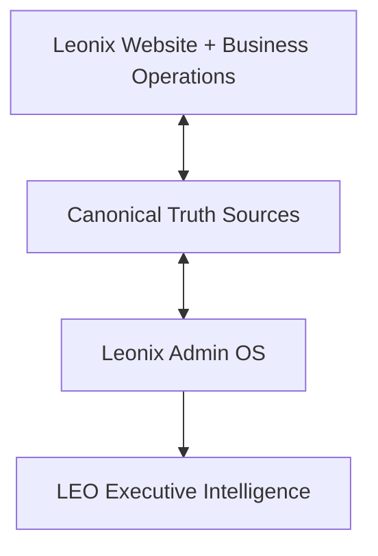

# LEONIX ADMIN OS — MASTER OPERATING BOOK

**Document role:** Permanent operating constitution, control-plane contract, human operations manual specification, and launch-certification standard for the Leonix Admin OS.  
**Primary audience:** Owner/CEO, authorized Leonix staff, Claude implementation agent, future LEO integration work, and any future operator responsible for continuity of the company.  
**Status:** Locked operating constitution + current verified repository baseline + required cable-mapping, human-operability, continuity, and LEO-readiness contract.  
**Purpose:** Make Leonix Admin the complete, reliable, searchable, teachable, independently operable control plane and book of record for the entire company — past, present, and future — while making LEO an optional intelligent assistant that reads and acts through that same canonical truth without becoming a dependency.

---

# 0. READ THIS FIRST

This project is **not a new-feature build**.

Leonix is treated as functionally feature-complete for this pass. The job now is to trace, organize, reconcile, repair, verify, and certify what already exists so the owner can launch and operate the company from Admin without needing to remember hidden routes, inspect Supabase manually, open code for normal business operations, or discover broken wiring only after a customer complains.

The core analogy is an **organized network rack**:

- The Leonix website, marketplace, staff tools, customer tools, revenue tools, content systems, moderation systems, analytics, and integrations are the cables.
- Canonical data sources and services are the wiring.
- Admin is the patch panel and control board.
- LEO is the intelligent operator who reads the labeled rack, understands the company state, and tells the owner what matters.

The goal is not to cut working wires or rebuild the rack. The goal is to know exactly where every wire begins, where it ends, what it controls, whether it is tangled with another wire, whether it is split incorrectly, whether it is mislabeled, and whether it is actually working.

---

# 0A. CONSTITUTIONAL NORTH STAR — ADMIN MUST STAND ON ITS OWN

Leonix Admin is the **human operating system for the company**.

LEO is an assistant, not the company control plane.

The permanent architecture is:

```text
LEONIX PRODUCT / WEBSITE / BUSINESS OPERATIONS
        ↓
CANONICAL TRUTH SOURCES
        ↓
LEONIX ADMIN OS
        ↓
HUMAN OWNER / AUTHORIZED STAFF
        ↘
          LEO — OPTIONAL INTELLIGENT ASSISTANT OVER THE SAME TRUTH
```

The Admin OS must remain usable if LEO is unavailable, degraded, misconfigured, disabled, or wrong.

A company capability is not considered operationally complete merely because LEO can reach it. If the capability is necessary to run Leonix, an authorized human must be able to locate, understand, and operate it directly from Admin.

## ADMIN INDEPENDENCE DOCTRINE

The owner must be able to run Leonix manually from Admin without relying on:

- LEO
- ChatGPT or another external assistant
- source code for ordinary operations
- direct Supabase inspection for ordinary operations
- hidden or undocumented URLs
- personal memory of where a feature was built
- tribal knowledge held by one employee

True provider-owned administration may still require provider dashboards when unavoidable, such as legal identity verification or provider-level account recovery. In those cases, Admin must explain that dependency clearly and point the operator to the correct next step.

## MANUAL CONTROL PARITY

For every meaningful capability LEO can inspect, recommend, prepare, or invoke, the human Admin must provide the corresponding manual operating path where the action is permitted.

Examples:

- If LEO can identify a listing that should be reviewed, Admin must let a human open that listing, inspect evidence, and perform the authorized action manually.
- If LEO can identify a failed payment, Admin must let a human inspect the payment/customer context manually.
- If LEO can identify a staff follow-up, Admin must let a human see the owner, due date, notes, and next action manually.
- If LEO can navigate to a system, that system must also be discoverable without LEO.

No important operational control may exist only behind an AI interaction.

---

# 0B. HUMAN OPERABILITY AND BUSINESS CONTINUITY

Leonix must be operable by more than the person who built it.

The continuity test is:

> If the owner is unavailable for two weeks, can a qualified, authorized staff member open Admin, find the correct operational area, understand what it does, understand what they are allowed to do, and safely keep their assigned portion of Leonix operating?

If the answer is no, institutional knowledge is still trapped in the owner and the Admin OS is incomplete.

The Admin OS therefore must support:

- clear module ownership
- plain-language purpose and instructions
- discoverable manual paths
- role-aware permissions
- visible status meanings
- safe-action guidance
- escalation guidance
- continuity when one person is absent
- enough persisted history that operators do not need the owner's memory

This does not require creating a second staff product. The default architecture is **one Admin OS with permission-aware views and actions**. Specialized staff workspaces may exist where already justified, but they should remain part of the same company operating system.

---

# 0C. ADMIN GUIDE / OPERATIONS MANUAL DOCTRINE

Admin must be both:

1. the **cockpit** used to operate Leonix, and
2. the **flight manual** that teaches an authorized human how to operate it.

The manual must exist independently from LEO.

## TWO DIFFERENT SEARCH JOBS

### COMPANY SEARCH
Finds company records and entities, such as:

- a business
- customer/user
- listing
- payment/order
- lead
- support case
- report
- staff member
- magazine issue
- other canonical records

### ADMIN GUIDE SEARCH
Finds operational knowledge, such as:

- "How do I turn off a listing?"
- "Where do I change the homepage?"
- "How do I see failed payments?"
- "What does Needs Triage mean?"
- "Where do I create a staff login?"
- "How do I update a staff contact page?"
- "What do I do if Stripe is unavailable?"

These are different systems and must not be confused.

LEO may later provide a conversational interface over both, but neither search function may depend on LEO existing.

## EVERY ADMIN MODULE NEEDS A GUIDE ENTRY

Every meaningful Admin module should be registrable in a common operational-guide structure that can be searched, browsed, and linked contextually.

A guide entry should contain, where relevant:

```text
MODULE_NAME
OPERATING_DOMAIN
PURPOSE
WHEN_TO_USE_THIS
PRIMARY_ADMIN_ROUTE
ALTERNATE_ENTRY_POINTS
COMMON_TASKS
COMMON_SEARCH_TERMS / ALIASES
CANONICAL_ENTITIES
KEY_STATUSES_AND_MEANINGS
WHAT_THE_OPERATOR_CAN_DO
WHAT_REQUIRES_HIGHER_PERMISSION
DANGEROUS / RED_ACTIONS
RELATED_MODULES
DEPENDENCIES
COMMON_FAILURES
MANUAL_RECOVERY_PATH
WHO_NORMALLY_USES_THIS
PUBLIC_OR_CUSTOMER_IMPACT
AUDIT_EXPECTATION
LAST_VERIFIED_STATE
```

The guide should be accessible in at least two ways:

- centrally through **Admin Guide / Operations Manual**
- contextually through a **Help with this page / What can I do here?** entry point on meaningful Admin modules

The goal is not to bury paragraphs on every screen. The goal is to make guidance one click or one search away.

---

# 0D. PAST / PRESENT / FUTURE COMPANY MEMORY

The Leonix company book must represent more than current rows.

## PAST
Where supported, Admin should preserve and expose enough persisted evidence to answer:

- what happened
- who did it
- what changed
- what the prior state was where recorded
- previous interactions
- completed follow-ups
- payment history
- moderation/report decisions
- prior publication or listing state
- prior staff/customer actions

## PRESENT
Admin must clearly represent current operational truth:

- current customer/business state
- current listing/publication state
- current money/payment state
- current support state
- current staff assignments
- current website/content state
- current system/provider health

## FUTURE
Where persisted future obligations exist, Admin should represent:

- scheduled follow-ups
- due dates
- expirations
- renewals where supported
- future publication commitments
- pending approvals
- outstanding client actions
- future meetings or tasks
- deadlines

"Future" means persisted obligations and known scheduled state, not invented forecasting.

Any important operational fact that exists only in the owner's memory is a company-memory gap.

---

# 0E. ROLE-BASED OPERABILITY

Leonix Admin should remain one coherent operating system while respecting least privilege.

The owner/super-admin can see the whole company where authorized. Other staff should see or operate only what their role permits.

For unauthorized capabilities, the product may either:

- hide the control when revealing it would create confusion or risk, or
- show the module with an honest "Admin clearance required" state when discoverability and training are useful.

The decision should favor clarity, security, and maintainability — not duplicate dashboards.

Every staff-facing module should make clear:

- what the staff member can see
- what the staff member can do
- what requires escalation
- who owns the next action where known

---

# 0F. OWNER IDENTITY AND BREAK-GLASS ACCESS

The normal owner operating identity should be an attributable per-person account tied to the canonical staff roster and authorization model.

A bootstrap/shared-owner path, where retained, is an **emergency break-glass recovery mechanism**, not the preferred daily identity.

The break-glass path exists so a failure in ordinary staff authentication does not permanently lock the owner out of the company control plane.

Break-glass access must:

- remain protected
- remain clearly distinguishable from a normal staff identity
- not silently masquerade as a named person
- not be required for ordinary daily operations
- not become the only path into any normal operational system
- be documented in the Admin operations manual

Normal owner and staff activity should be attributable to real identities whenever the schema supports it.

---

# 0G. STAFF LIFECYCLE AND STAFF CONTACT IDENTITY

Staff operations are more than login creation.

Where Leonix already has staff contact/public-profile capability, Team administration must make that capability discoverable from the logical staff home.

The staff lifecycle should be understandable as separate but related concerns:

```text
STAFF PERSON
  ├── LOGIN / AUTH IDENTITY
  ├── ROSTER / ROLE / PERMISSIONS
  ├── STAFF CONTACT PROFILE / PUBLIC CONTACT PAGE, WHERE APPLICABLE
  ├── ASSIGNMENTS / CLIENTS
  ├── NOTES / FOLLOW-UPS
  └── AUDIT / ACTIVITY
```

Creating a staff login must not make the operator assume all staff setup is complete if an additional staff profile/contact-page step exists.

Admin should guide the operator through the relationship and provide clear navigation to manage or complete each applicable part.

Authorized staff should be able to maintain their own allowed profile/contact fields where product policy permits, while owner/admin retains appropriate control.

---

# 0H. OPERATIONAL CONTINUITY AND MANUAL RECOVERY

Automation and external providers will sometimes fail. Leonix must degrade intelligibly.

For critical integrations and automation, Admin should answer where detectable:

- what is unavailable
- what still works
- what data is trustworthy
- what action is blocked
- whether a safe manual path exists
- whether the issue requires the owner, staff, provider dashboard, or engineering

If a provider-owned operation cannot be reproduced manually inside Leonix, Admin should say so plainly rather than presenting a dead control.

The system must avoid a "button shut off" mentality where the operator sees a diagnosis but cannot reach the underlying human control.

---

# 0I. FUTURE-SYSTEM ADMISSION CONTRACT

The Admin OS must remain extensible without becoming a maze.

A new Leonix operational capability is not considered company-ready until its Admin relationship is declared.

Every future operational system should identify, where applicable:

```text
SYSTEM_NAME
OPERATING_DOMAIN
CANONICAL_ENTITY
CANONICAL_ID
CANONICAL_DATA_SOURCE
PRIMARY_ADMIN_HOME
COMPANY_SEARCH_SUPPORT
ADMIN_GUIDE_ENTRY
BUSINESS/CUSTOMER_RELATIONSHIP
PAYMENT/ENTITLEMENT_RELATIONSHIP
MODERATION/REPORT_RELATIONSHIP
ANALYTICS_RELATIONSHIP
AUDIT_RELATIONSHIP
SYSTEM_HEALTH / FAILURE STATE
MANUAL_OPERATING_PATH
ROLE/PERMISSION MODEL
LEO_SAFE_READ_SOURCE
```

This is the standard "paper and pen" for adding future chapters to the Leonix company book.

New capabilities should plug into this structure rather than creating new hidden islands.

---

# 0J. LEO FAILURE TEST

Before LEO integration can be certified, the Admin OS must pass this test:

> If LEO is completely unavailable, can the owner still locate the affected entity, understand its state, inspect the evidence, determine the appropriate next action, and perform every authorized manual action that the business requires?

And this continuity test:

> If the owner is unavailable, can an authorized staff member use Admin guidance, search, permissions, and persisted company truth to safely perform their assigned responsibilities without relying on undocumented owner knowledge?

If either answer is no for a launch-critical operational area, Admin is not independently operable.

---

# 1. LAUNCH-TOMORROW STANDARD

Assume Leonix launches tomorrow.

The owner must be able to operate Leonix from Admin as a one-person company without relying on memory of route architecture or code internals.

The launch test is:

> Can the owner understand, control, investigate, and act on the meaningful state of the Leonix company from Admin, with clear truth, clear ownership, clear actions, and clear failure states?

Admin must function as the control plane for all of these operational domains:

1. COMMAND
2. REVENUE
3. MARKETPLACE OPS
4. PEOPLE
5. WEBSITE
6. SYSTEM

These domains are organizational ownership boundaries, not excuses to fragment truth.

Every meaningful existing Leonix capability must have an appropriate relationship to Admin. Not every public feature requires an editor, but every operationally significant capability must be visible, controllable, searchable, explainable, auditable, or monitorable where appropriate.

Nothing operationally important should be orphaned on either side.

---

# 2. THE COMPANY BOOK MODEL

Admin is the **Leonix company operating book**.

LEO will later read this book.

The hierarchy is:

```text
LEONIX COMPANY
    ↓
OPERATING DOMAIN
    ↓
SYSTEM / MODULE
    ↓
ENTITY
    ↓
RECORD
    ↓
EVENT / EVIDENCE
```

The owner should not need to know where the raw record lives.

Example:

```text
LA TAQUIZA
    ↓
Canonical Leonix Business Identity
    ├── Customer / contacts
    ├── Business Concierge relationship
    ├── Listings / ads
    ├── Packages / entitlements
    ├── Contracts
    ├── Payments
    ├── Publication state
    ├── Moderation / reports
    ├── Magazine placements
    ├── Support cases
    ├── Notes / follow-ups
    ├── Analytics
    └── Audit history
```

If the owner says:

> "LEO, La Taquiza called and says their ad isn't working."

LEO must eventually be able to locate La Taquiza through canonical identity and determine, from real evidence, whether the problem is:

- payment failed
- entitlement inactive
- listing unpublished
- listing expired
- moderation hold
- reports/complaints
- category/publication blocker
- failed edit/republish
- missing asset
- customer/support issue
- provider/system failure
- or another known state

LEO must not guess.

---

# 3. THE FOUR-LAYER ARCHITECTURE



## Layer 1 — Leonix product and company
The actual public site, marketplace categories, Business Concierge, advertising, magazine, Tienda, support, staff operations, payments, analytics, and all other current business capabilities.

## Layer 2 — Canonical truth
Supabase tables, canonical IDs, server services, provider APIs, configuration, server actions, read models, and audit records that define what is actually true.

## Layer 3 — Admin OS
The owner/staff control plane. Admin must surface canonical truth, make the right actions available, provide understandable failure states, and route the owner to the correct operational context.

## Layer 4 — LEO
LEO reads the same canonical Admin truth. LEO should not scrape the dashboard, duplicate counts, invent a second business model, or build parallel logic for the same operational fact.

---

# 3A. ENVIRONMENT TRUTH DOCTRINE

Leonix operates more than one Supabase project. As of this pass, known projects include:

```text
Leonix Media              — canonical production truth
Leonix Media Staging      — isolated staging/test work only
Leonix Certification      — isolated certification/test work only
```

**Production Admin/business truth = Leonix Media.** Staging and certification projects must never become implicit substitutes for it — not for reasoning about real owner/staff/customer state, not for citing "current" data in a report to the owner, and not for any decision that assumes the outcome applies to production.

Before any live Supabase inspection or mutation, in this order:

1. Identify the configured Supabase project (by its real project name, not by assumption).
2. Prove which project ref/environment is actually being targeted — do not infer this from a worktree's `.env.local` alone; confirm it against the real project list.
3. State explicitly whether the confirmed project is Leonix Media (production).
4. If the target is staging, certification, or cannot be confirmed, **STOP** — do not proceed as if it were production, and do not silently substitute it as evidence for a production claim.

This doctrine exists because local/dev configuration can point at any of the three projects, and a worktree's own `.env.local` is not, by itself, proof of which project it names — the name must be cross-checked against the real Supabase project list before any live inspection is trusted as production truth.

---

# 4. GLOBAL ADMIN OWNERSHIP MODEL

Every meaningful operational system should have **one primary Admin home**.

Contextual shortcuts and deep links are allowed.

Duplicate primary ownership is not.

## COMMAND
Primary purpose: what matters now.

Includes:
- LEO entry
- Command Center
- Today's Attention
- executive summaries
- priority engine
- global search / company lookup
- operational alerts
- executive reports
- "Handle now / Handle today / Can wait / Informational"

## REVENUE
Primary purpose: money and commercial lifecycle.

Includes:
- leads
- media kit inquiries
- promotional / print quote leads
- advertising opportunities
- packages
- entitlements
- payments
- promo codes
- contracts
- sales tracker
- Tienda revenue/order operations
- renewals
- failed/pending payments
- commercial Business Concierge handoff

## MARKETPLACE OPS
Primary purpose: all marketplace/public listing operations.

Includes:
- categories
- listings
- moderation
- reports
- expiration
- visibility
- featured/verified
- public listing health
- category-specific operations
- travel/Viajes operational surfaces
- Recursos where it functions as marketplace/community data
- Tienda where it functions as marketplace/catalog operations

## PEOPLE
Primary purpose: people, customers, businesses, staff, support.

Includes:
- Leonix businesses
- customer/business 360
- users
- Business Concierge
- support
- team/staff
- permissions
- assignments
- notes
- follow-ups
- meeting outcomes
- customer lifecycle

## WEBSITE
Primary purpose: public-site/content control.

Includes:
- Home
- Revista
- Noticias
- Iglesias
- Recursos content where applicable
- Clasificados landing/content
- Tienda storefront
- Nosotros
- Contacto
- Anúnciate
- global site settings
- site sections
- language/content QA
- banners/announcements/settings where real

## SYSTEM
Primary purpose: health, governance, integrations, proof.

Includes:
- activity/audit log
- permissions/governance
- system health
- integration/provider readiness
- Supabase availability
- environment/config readiness
- failed jobs/operations
- alerting
- language/system audits
- unavailable dependency states

---

# 5. OPERATOR TRUTH CONTRACT

Every actionable issue shown to the owner must answer these seven questions from persisted evidence where available:

1. **WHAT happened?**
2. **WHY is this in the attention queue?**
3. **WHAT triggered it?**
4. **WHAT evidence supports it?**
5. **HOW serious is it?**
6. **WHAT is the recommended solution / next action?**
7. **WHAT happens if I do nothing, when knowable?**

If provenance is missing:

```text
STATUS: NEEDS_TRIAGE
CAUSE: Unknown
EVIDENCE: Missing or insufficient
RECOMMENDED ACTION: Investigate the canonical source
```

Do not fabricate a cause merely to make the UI look complete.

---

# 6. TRUTH-STATE CONTRACT

Use these states consistently:

## REAL
A real data source exists and a real working code path is present.

## PARTIAL
A real capability exists, but the operational loop is incomplete.

## NEEDS_PROOF
Code appears to support the capability, but runtime/schema/provider proof is not currently available.

## BROKEN
An expected existing capability is demonstrably broken.

## UNAVAILABLE
A required provider/source is unavailable in the current environment.

## PLANNED
Only use when repository evidence proves something is genuinely designed but not implemented.

Never collapse unavailable, unknown, or unreadable data into zero.

---

# 7. ACTION / CTA CONTRACT

Every important CTA must have a complete action truth chain:

```text
SOURCE PAGE
    ↓
CANONICAL ENTITY / ID
    ↓
DESTINATION OR ACTION
    ↓
SERVICE / SERVER ACTION / API
    ↓
AUTHORIZATION
    ↓
WRITE OR NAVIGATION RESULT
    ↓
SUCCESS FEEDBACK
    ↓
FAILURE FEEDBACK
    ↓
AUDIT / RECEIPT WHEN APPROPRIATE
```

Classify every important CTA as:

- WORKS
- PARTIAL
- BROKEN
- WRONG_DESTINATION
- DUPLICATE
- HONESTLY_DISABLED
- NEEDS_PROVIDER
- NEEDS_DATA

## Before-action vs after-action
- Tooltip/helper = what the action will do before the owner clicks.
- Confirmation = required for dangerous/high-impact actions.
- Toast/result/receipt = what actually happened after the action.

## Raw technical errors are not an acceptable operator experience
The owner should not learn about missing Supabase objects, provider config, or environment variables by clicking a random button and seeing an implementation error.

Instead Admin should surface a meaningful owner-facing state.

Example:

```text
Unable to load payment status.
Stripe connection is unavailable in this environment.
Recommended action: System → Integrations.
```

System Health should surface the dependency before the owner discovers it randomly.

---

# 8. GOVERNANCE / ACTION SAFETY

## GREEN — safe read/analysis
LEO/Admin may:
- read
- search
- analyze
- filter
- summarize
- navigate
- prioritize
- present

## YELLOW — reversible preparation
May:
- draft
- prepare
- stage
- assemble suggested actions
- create reversible internal work where authorized

## RED — protected owner-impacting actions
Requires owner approval and correct authorization:

- delete
- publish/unpublish where customer-impacting
- money movement
- pricing changes
- contract execution
- staff permission changes
- irreversible customer-impacting changes
- external sends when not explicitly approved
- production release

AI moderation remains advisory. Human final decision remains authoritative.

---

# 9. CANONICAL ENTITY RELATIONSHIPS

Where they exist, Admin and LEO should use canonical identifiers and persisted relationships.

Examples of canonical entity classes that may exist in current systems:

```text
BUSINESS_ID
CUSTOMER_ID
PROFILE_ID
LISTING_ID
LEAD_ID
ORDER_ID
PAYMENT_ID
ENTITLEMENT_ID
CONTRACT_ID
REPORT_ID
SUPPORT_CASE_ID
MODERATION_REVIEW_ID
MAGAZINE_ISSUE_ID
STAFF_ID
AUDIT_EVENT_ID
```

The exact current schema must be verified in the repository/database before assuming specific names.

The operational goal is:

> one business context can connect all of the records that belong to that relationship.

Do not infer relationships from names when canonical IDs already exist.

If a relationship is missing, record that as a real cable gap.

---

# 10. WEBSITE ↔ ADMIN CROSS-REFERENCE RULE

The Admin certification must work in both directions.

## Direction A — Public/Product → Admin
For every public feature or business workflow:

> Where is its Admin wire?

Questions:
- Can Admin see it?
- Can Admin control what should be controllable?
- Can Admin understand its state?
- Can Admin locate its records?
- Can Admin inspect its failures?
- Can Admin view analytics where supported?
- Can Admin see reports/moderation where supported?
- Can Admin see payment/entitlement where applicable?
- Can Admin see audit history where applicable?
- Can LEO later read the canonical truth?

## Direction B — Admin → Product/Business
For every Admin card, tab, CTA, metric, report, or control:

> What real system does this operate?

Questions:
- What table/service/provider owns the truth?
- Is the count canonical?
- Is it a proxy?
- Is it duplicated elsewhere?
- Does the CTA operate the correct entity?
- Is the route legacy?
- Is there a newer canonical destination?
- Is the label truthful?

No orphaned controls.
No orphaned public features.

---

# 11. VERIFIED CURRENT REPOSITORY BASELINE

This section records facts already proven from current repository evidence at the Admin OS base commit.

## 11.1 Six Admin OS groups already exist
The current `adminGlobalNav.ts` defines:

- command
- revenue
- marketplace-ops
- people
- website-control
- system

This is aligned with the operating model in this document.

## 11.2 Current primary nav contains real destinations including
- `/admin/leo`
- `/admin`
- `/admin/businesses`
- `/admin/leads/inbox`
- `/admin/workspace/clasificados`
- `/admin/ops`
- `/admin/workspace/payment-tracker`
- `/admin/team/roster`
- `/admin/usuarios`
- `/admin/support`
- `/admin/workspace`
- `/admin/site-settings`
- `/admin/clasificados/viajes`
- `/admin/activity-log`
- `/admin/system-health`
- `/admin/settings`
- `/admin/workspace/language-audit`
- `/admin/tienda`
- `/admin/recursos`

The current nav source itself documents some compatibility/legacy route decisions, including the old `/admin/payments` compatibility route and active path aliases around category/revenue tools.

## 11.3 Existing audit evidence says the strongest real areas include
- executive Command Center
- launch leads
- classifieds operations
- reports
- users
- support tickets
- staff roster
- Tienda
- promo/package/payment trackers
- site section editing
- magazine issue lifecycle
- activity log
- several admin API mutation routes

## 11.4 Existing audit evidence also identified known architectural confusion
- overlapping Viajes routes
- Website Control split across multiple route families
- duplicate Magazine route families
- Revenue tools distributed across multiple trackers/pages
- some pages acting as aliases, planning surfaces, or partial read models

## 11.5 Current repository evidence also shows newer additions
The current nav includes `/admin/recursos`, explicitly described in code as "Recursos Data OS".

The repository baseline also contains Website/Admin workspace support for Iglesias and Noticias in earlier Admin audits, and a real staff public-contact system ("Executive Hub", `public.executives`, `/contact/[slug]`) previously under-linked from Team. These newer/expanded systems must be verified against current code, not assumed complete from historical docs alone.

---

# 12. CURRENT ADMIN OS WORKTREE STATE

Canonical worktree for this pass:

```text
C:\projects\elaguila-website\.claude\worktrees\admin-os+canonical-truth-2026-09
```

Branch:

```text
worktree-admin-os+canonical-truth-2026-09
```

Starting/base HEAD (original V1 cable-mapping pass):

```text
a0a4783971b42ea1d71ab2602d4720d0d590baf8
```

V2 Constitution alignment audit base HEAD:

```text
d458cd1e6fd998e1eb36c0275004fd31f6b1ee81
```

Rules:
- do not create another worktree for this Admin OS pass
- do not move this work into a top-level sibling folder
- do not touch LEO worktrees
- do not touch unrelated worktrees
- do not push until the owner explicitly approves
- preserve existing uncommitted Admin OS work

---

# 13. CURRENT IMPLEMENTATION STATE

See `docs/admin-os/ADMIN_OS_PROGRESS.md` for the full pass-by-pass history. As of the V2
Constitution alignment audit, the V1-era Master Book's launch-certification requirements
(§32 v1, now superseded by §32 below) were reported complete and code-integration-ready across
multiple validation gates (typecheck, targeted lint, production build, targeted verification,
static migration validation — see PROGRESS.md's "FINAL CODE/RELEASE VALIDATION GATE" section).
The V2 Constitution alignment pass (this section's current owner) audits that same implementation
against the expanded V2 doctrine above (§0A–§0J) and records its findings in PROGRESS.md's "V2
CONSTITUTION ALIGNMENT AUDIT" section — do not assume V1 completeness implies V2 completeness;
V2 introduces materially new requirements (Admin Guide, Admin Guide Search distinct from Company
Search, staff contact/profile continuity, owner break-glass doctrine, future-system admission
contract) that the V1-era work was never scoped to satisfy.

---

# 14. MODERATION OPERATING CONTRACT

Every moderation/review item should expose, where supported:

- entity/listing
- source
- reason
- evidence
- age
- severity/risk
- current case state
- recommended action
- seller/business context
- reports
- AI moderation result
- human decision
- audit history

Suggested case lifecycle:

```text
OPEN
→ TRIAGE
→ INVESTIGATING
→ AWAITING SELLER
→ ACTION REQUIRED
→ RESOLVED
```

A resolved case should leave the active queue.

A new signal occurring after resolution may reopen the case if repository/schema design supports that safely.

Source classes should distinguish where truth came from, such as:
- human report
- AI review
- status flag
- deterministic/category rule
- staff action
- legacy/unknown

Missing provenance must become NEEDS_TRIAGE, not invented certainty.

---

# 15. PRIORITY ENGINE CONTRACT

Priority is not "whatever appears first in the database."

Priority should derive from real operational factors, including where supported:

- age
- due date
- overdue state
- money/revenue impact
- customer waiting
- trust/safety impact
- launch blocker
- publication blocker
- manual escalation
- support severity
- failed payment
- expiration window
- system outage/degradation

Allowed owner-facing classes:

```text
CRITICAL
HIGH
MEDIUM
LOW
INFORMATIONAL
```

The Command Center presentation should roll these into:

```text
HANDLE NOW
HANDLE TODAY
CAN WAIT
INFORMATIONAL
```

The owner must be able to understand why each item is there.

---

# 16. CUSTOMER / BUSINESS 360 CONTRACT

A one-person company cannot operate from disconnected records.

Admin needs a canonical business/customer context where the existing schema allows it.

The Business 360 view should eventually be able to surface:

```text
IDENTITY
CONTACTS
BUSINESS STATUS
BUSINESS CONCIERGE STAGE
LISTINGS / ADS
PACKAGES / ENTITLEMENTS
PAYMENTS
CONTRACTS
PUBLICATION STATE
MODERATION / REPORTS
MAGAZINE
SUPPORT
NOTES
FOLLOW-UPS
MEETINGS
ASSETS
CREATIVE STATUS
ANALYTICS
RENEWAL
AUDIT HISTORY
```

Not every item has to live on one giant page.

The requirement is relational truth and clean navigation.

Global Search and LEO should use this same relationship model.

---

# 17. GLOBAL SEARCH CONTRACT (= COMPANY SEARCH, see §0C)

Global Search is the company patch panel — this is the same system §0C calls "Company Search,"
distinct from Admin Guide Search.

It should locate supported entities by real identifiers such as:
- business name
- customer/user name
- email
- phone
- canonical business ID
- listing ID
- order ID
- support case
- lead
- report
- staff member
- other real searchable IDs where supported

Search should navigate to canonical Admin context, not a generic dead-end result.

Do not add fake search support for entity types that are not actually indexed.

---

# 18. WEBSITE CONTROL CONTRACT

Website Control is not merely "content editing."

It is the operational relationship between Admin and the public Leonix site.

Every major current public section should be checked for:
- public route
- content/data source
- publication state
- Admin ownership route
- edit capability where appropriate
- preview capability where appropriate
- language state
- analytics where supported
- public failure state
- audit trail where appropriate
- LEO read path

Current sections to cross-reference include at minimum:
- Home
- Clasificados
- Tienda
- Revista
- Noticias
- Iglesias
- Recursos
- Nosotros
- Contacto
- Anúnciate
- global site settings
- language controls

This list must be expanded from actual current repository discovery.

---

# 19. MARKETPLACE CONTROL CONTRACT

The marketplace audit must discover the current canonical category registry and all real category-specific verticals.

Known Leonix category families include examples such as:
- Servicios
- Restaurantes
- Empleos
- Rentas
- Bienes Raíces
- Autos
- En Venta / Varios
- Clases
- Comunidad
- Mascotas y Perdidos
- Busco / Se Busca
- Viajes
- Ofertas Locales

Do not treat this list as authoritative if the current registry differs.

For every category:
- public discovery route
- publish/application route
- canonical listing storage
- preview/edit lifecycle
- owner/business identity
- entitlement/payment behavior if applicable
- moderation/report path
- expiration
- visibility
- analytics
- Admin ops route
- category-specific actions
- public CTA behavior
- canonical listing ID
- status model

All category behavior must be mapped before claiming Marketplace Ops is launch-ready.

---

# 20. REVENUE CONTROL CONTRACT

The Revenue book must connect the full commercial lifecycle.

Questions Admin must answer:
- Who is a lead?
- What did they ask for?
- Has anyone replied?
- What is the next action?
- Is there a quote?
- Is there an advertising package?
- Is there an entitlement?
- Is there a contract?
- Is payment pending/failed/complete?
- Is the ad ready to publish?
- Is anything blocked by money?
- Is a renewal approaching?
- Is there a promo/discount applied?
- Is Tienda involved?

Where provider truth is external, Admin must label what is known vs provider-dependent.

Never represent payment success if only a local intent exists.

---

# 21. PEOPLE / STAFF / SUPPORT CONTRACT

Admin must let the owner understand:
- users
- customers
- businesses
- staff
- team members
- assignments
- permissions
- support cases
- notes
- follow-ups
- who owns the next action
- overdue follow-ups
- customer waiting state
- last interaction
- current stage
- business relationship

Support must not become a disconnected ticket list.

Where possible, support should link directly to:
- user/customer
- business
- listing/ad
- payment/order
- report/moderation case
- Business Concierge record

See also §0G for the staff lifecycle (login/auth identity, roster/role, staff contact profile,
assignments, notes/follow-ups, audit) — staff are people too, and their own continuity matters as
much as customer continuity.

---

# 22. SYSTEM HEALTH CONTRACT

Admin must not make the owner discover system configuration failures through random buttons.

System Health should report real, detectable health for:
- Supabase/data availability
- critical table/schema availability
- external providers
- payment provider connectivity
- email/SMS integrations where present
- background jobs where present
- critical API failures where observable
- audit pipeline
- required environment/config availability where safely detectable

Never expose secret values.

System Health may report:
- healthy
- degraded
- unavailable
- needs proof

If a dependency cannot be detected reliably, do not fake a green status.

Per §0H, where a critical integration is unavailable, System Health (or the affected module) must
say what still works, what is blocked, and whether a safe manual path exists — not just report the
failure and leave the operator with a dead control.

---

# 23. LEO CONTRACT

LEO is not implemented by this document.

This document defines the future contract.

LEO must consume the same canonical truth Admin uses.

## LEO_NAVIGATION
May identify and open the correct Admin destination.

## LEO_READ
May read canonical operational truth.

## LEO_PRESENT
May summarize, explain, compare, prioritize, and brief the owner.

## LEO_PREPARE
May draft or stage reversible work where supported.

## LEO_EXECUTE_REQUIRES_APPROVAL
May only execute protected actions after proper owner approval and authorization.

## LEO_FORBIDDEN
Must not autonomously:
- delete important customer/business data
- move money
- change pricing
- execute contracts
- change permissions
- publish destructive/customer-impacting changes
- release production
- invent missing evidence
- create a second truth model

Per §0A, LEO must never become the only path to a launch-critical operational control or company
fact — see the LEO Failure Test (§0J) for the certification standard.

---

# 24. DAILY OWNER QUESTIONS THE SYSTEM MUST EVENTUALLY ANSWER

These are launch-certification scenarios, not just examples.

```text
Who needs me right now?
Who has been waiting too long?
Who has no next action?
What payments failed?
What money is at risk?
What ads/listings are blocked?
Why is this listing not live?
Which listings expire this week?
What was reported?
What did AI flag and why?
What did a human decide?
Which clients need follow-up?
Which contracts/payments are incomplete?
What is ready to publish?
What support case is unresolved?
What changed today?
What broke overnight?
Which system is unhealthy?
What cannot wait?
What can wait?
```

Business-specific example:

```text
LEO, La Taquiza says their ad is not working.
```

Expected resolution path:

```text
Find canonical business
→ find listing/ad
→ payment/entitlement
→ publication state
→ moderation/reports
→ expiration
→ recent audit/failure
→ explain cause
→ show evidence
→ recommend action
→ navigate to correct Admin control
```

---

# 25. 30-CLIENT SCALE TEST

The Admin OS must be tested as if Leonix had at least 30 simultaneous active client relationships.

For each client, determine whether Admin can reliably represent:

```text
owner
business
status
stage
last interaction
next action
due date
follow-up
notes
assets
creative
quote
contract
payment
publication
support
renewal
```

Classify each field using the allowed final classification vocabulary (see ADMIN_OS_PROGRESS.md):
`CLOSED`, `NEEDS_MIGRATION`, `NEEDS_RUNTIME_PROOF`, `EXTERNAL_BLOCKER`, `OWNER_DECISION_REQUIRED`,
`NOT_APPLICABLE`. Vague `TRUE`/`PARTIAL`/`FALSE` labels are historical only — final matrices must
use the six-class vocabulary.

Any field that requires the owner's memory instead of persisted company truth is an operational gap.

---

# 26. CABLE MAP — REQUIRED TECHNICAL SCHEMA

The detailed technical map lives in:

```text
docs/admin-os/ADMIN_OS_CABLE_MAP.md
```

Every discovered system/module should record:

```text
SYSTEM
DOMAIN
PUBLIC_OR_BUSINESS_PURPOSE
PUBLIC_ROUTE_OR_ENTRY
PRIMARY_COMPONENT
CANONICAL_ENTITY
CANONICAL_ID
CANONICAL_DATA_SOURCE
READ_SERVICE
WRITE_SERVICE_OR_SERVER_ACTION
API_ROUTE_IF_ANY
PRIMARY_ADMIN_ROUTE
ALTERNATE_ADMIN_ENTRY_POINTS
ADMIN_READ_CAPABILITY
ADMIN_WRITE_CAPABILITY
GLOBAL_SEARCH_SUPPORT (= COMPANY_SEARCH_SUPPORT, §0C)
ADMIN_GUIDE_ENTRY (§0C — new, V2)
CUSTOMER_OR_BUSINESS_CONTEXT_LINK
PAYMENT_OR_ENTITLEMENT_LINK_IF_APPLICABLE
MODERATION_OR_REPORT_LINK_IF_APPLICABLE
ANALYTICS_LINK_IF_APPLICABLE
AUDIT_LINK
SYSTEM_HEALTH_RELATIONSHIP (§0I — new, V2)
MANUAL_OPERATING_PATH (§0A — new, V2)
LEO_SAFE_READ_SOURCE
CTA_DESTINATIONS
CURRENT_TRUTH_STATUS
KNOWN_DUPLICATION
KNOWN_BROKEN_OR_SPLIT_WIRING
MISSING_ADMIN_CONTROL
MISSING_RELATIONSHIP
NOTES
```

This is also the Future-System Admission Contract's (§0I) practical schema — a new system is not
company-ready until it can fill in this row honestly.

The Cable Map is the electrician's schematic.

This Master Operating Book is the company operating constitution.

---

# 27. PERSISTENT STATE FILES

Claude should treat these as canonical project state:

```text
docs/admin-os/LEONIX_ADMIN_OS_MASTER_OPERATING_BOOK.md
docs/admin-os/ADMIN_OS_CABLE_MAP.md
docs/admin-os/ADMIN_OS_PROGRESS.md
docs/admin-os/ADMIN_OS_TESTS.json
```

Meaning:

- **MASTER OPERATING BOOK** = expected company behavior and launch constitution (this file — now V2)
- **CABLE MAP** = current repository wiring and gaps
- **PROGRESS** = current phase/bookmark
- **TESTS** = what has actually been proven

Conversation history is not the primary project memory.

---

# 28. CLAUDE CONTEXT / COMPACTION PROTOCOL

This project may span multiple Claude context windows.

When context becomes large:

1. Persist all new facts to the four state files.
2. Do not leave important conclusions only in chat.
3. Allow compaction or restart.
4. Resume by reading the state files and git state.
5. Continue from CURRENT_PHASE / NEXT_ACTION.

Resume instruction:

```text
Read first:

docs/admin-os/LEONIX_ADMIN_OS_MASTER_OPERATING_BOOK.md
docs/admin-os/ADMIN_OS_CABLE_MAP.md
docs/admin-os/ADMIN_OS_PROGRESS.md
docs/admin-os/ADMIN_OS_TESTS.json

Then inspect:
- pwd
- git status
- recent git log

The Master Operating Book defines expected Leonix behavior (V2 constitution).
The Cable Map defines current repository wiring.
The Progress file defines current work.
The Tests file defines proven behavior.

Do not reconstruct the project from conversation history.
Resume the recorded current phase.
```

---

# 29. EXECUTION SEQUENCE

The correct order is:

```text
CURRENT REPO
    ↓
FULL CABLE TRACE
    ↓
ADMIN_OS_CABLE_MAP.md
    ↓
BUILT vs EXPECTED vs GAP
    ↓
ORDERED REPAIR PLAN
    ↓
SURGICAL REPAIRS
    ↓
CTA / TRUTH / RELATIONSHIP CERTIFICATION
    ↓
30-CLIENT TEST
    ↓
V2 CONSTITUTION ALIGNMENT (ADMIN INDEPENDENCE, GUIDE, SEARCH, AUTH CONTINUITY, STAFF CONTINUITY)
    ↓
LAUNCH CERTIFICATION
    ↓
LEO INTEGRATION
```

Do not skip the cable-map gate.

Do not restart broad auditing after the map is complete unless new code materially changes the architecture, or a new constitutional revision (like this V2 pass) expands what "done" means.

---

# 30. BUILT / EXPECTED / GAP FORMAT

For every major system, record three different kinds of truth.

## BUILT
What current repository/runtime evidence proves exists.

## EXPECTED
What this Operating Book says launch behavior must be.

## GAP
The difference.

Example:

```text
SYSTEM: Recursos

BUILT:
Public Recursos system exists.
Current Admin route exists.
Current repository data/control wiring = [fill from verified code].

EXPECTED:
Owner can understand and operate all operational Recursos behavior from Admin.
LEO can read its canonical state.

GAP:
[fill only from verified evidence]

ACTION:
[ordered repair]
```

This prevents the project from confusing "desired behavior" with "already implemented behavior."

---

# 31. REPAIR DOCTRINE

Once the cable map is complete:

- preserve proven working behavior
- prefer canonicalization over replacement
- prefer reusable global services where they already fit
- preserve category-specific adapters where required
- fix split truth before redesigning presentation
- fix broken routes/IDs before styling
- fix raw errors before cosmetic polish
- preserve deep links through redirects/aliases when appropriate
- do not delete a legacy route until callers are proven and a safe destination exists
- do not create speculative abstractions
- do not add new product features unless the audit proves a launch-critical capability is genuinely missing

---

# 32. FINAL LAUNCH CERTIFICATION

The Admin OS is launch-ready only when all of the following are true or explicitly classified as a genuine external/owner-controlled dependency:

1. The current public website/product is cross-referenced against Admin.
2. The current Admin is cross-referenced against real product/company systems.
3. Major operational systems have canonical truth sources.
4. Every major system has one primary Admin operational home or an explicitly recorded external dependency.
5. Duplicate/split/tangled truth paths are reconciled.
6. Important CTAs work or are honestly disabled/labeled.
7. No critical operator flow exposes raw implementation errors.
8. Customer/business relationships can be navigated through canonical IDs where supported.
9. Newer systems such as Recursos/Iglesias/Noticias are included in the operating book.
10. Moderation/report/payment/expiration/support states explain why they matter and what to do.
11. System Health surfaces real detectable dependency failures.
12. 30-client simulation does not require owner memory for critical operational state.
13. Company Search can locate supported canonical records and route to meaningful Admin context.
14. Admin Guide / Operations Manual can teach an authorized human where to go, what a module does, what statuses mean, what actions are available, and what to do when common failures occur.
15. Every meaningful Admin module has a discoverable guide/manual relationship or is explicitly documented as not applicable.
16. Owner can operate launch-critical Leonix functions manually without LEO.
17. LEO is not the only path to any launch-critical operational control or company fact.
18. An authorized staff member can operate their assigned responsibilities without relying on undocumented owner memory.
19. Staff login, roster/permissions, and existing staff contact/profile capabilities are correctly related and discoverable.
20. Normal owner activity uses an attributable identity; any bootstrap path is clearly treated as emergency break-glass access rather than the daily operating identity.
21. Past operational evidence, present state, and persisted future obligations are surfaced where supported by current schema.
22. Manual recovery/degradation guidance exists for critical provider/system failures where a manual path is possible.
23. Future-system admission rules are documented so new features cannot become orphaned operational islands.
24. LEO has a clear read/navigation/prepare/action-safety contract to the same canonical truth and the same operational guide.
25. Production build/typecheck/lint/targeted verification are green except explicitly documented pre-existing unrelated failures.
26. Remaining gaps are genuine external blockers, irreversible production decisions requiring owner approval, unavailable providers, or unresolved business decisions — not locally fixable omissions.

## REQUIRED INDEPENDENCE VERDICTS

Before LEO integration, certification must explicitly answer:

```text
ADMIN_INDEPENDENTLY_OPERABLE: YES | NO
STAFF_CONTINUITY_READY: YES | NO
ADMIN_GUIDE_COMPLETE: YES | NO
COMPANY_SEARCH_COMPLETE: YES | NO
BREAK_GLASS_RECOVERY_DEFINED: YES | NO
PAST_PRESENT_FUTURE_TRUTH_COVERED: YES | NO
```

A single NO on a launch-critical requirement means the Admin OS is not ready for LEO integration.

## FINAL PROJECT VERDICT

Final verdict must be exactly one of:

```text
READY_FOR_LEO_INTEGRATION
NOT_READY_FOR_LEO_INTEGRATION
```

No "almost done."
No "LEO will make up for it."
No "the owner remembers how."
No hidden manual steps.
No undocumented operational islands.

---

# 33. INITIAL CABLE-MAPPING DIRECTIVE FOR CLAUDE

Claude should now use this document as the operating contract and execute the current-repository mapping pass.

Required first actions:

```text
1. Confirm current worktree and branch.
2. Read this Master Operating Book.
3. Read ADMIN_OS_PROGRESS.md.
4. Read ADMIN_OS_TESTS.json.
5. Inspect current uncommitted Phase 1/2 changes.
6. Create/update ADMIN_OS_CABLE_MAP.md.
7. Cross-reference current public/product routes against Admin.
8. Cross-reference current Admin controls against real product/company systems.
9. Record BUILT / EXPECTED / GAP.
10. Produce an ordered repair plan.
```

Do not begin broad repair implementation until the map is sufficiently complete to prevent duplicate work and accidental rewiring.

---

# 33A. PERMANENT BOOK-MAINTENANCE RULE

The Admin operating book is a living company asset, not a one-time launch document.

Whenever a new system is added, an old system is replaced, a route changes, a provider changes, or a staff workflow changes, the corresponding operational chapter must be updated as part of completion.

The book must remain easier to extend than to bypass.

The required maintenance loop is:

```text
NEW / CHANGED CAPABILITY
        ↓
DECLARE CANONICAL TRUTH + ADMIN HOME
        ↓
UPDATE CABLE MAP
        ↓
UPDATE ADMIN GUIDE ENTRY + SEARCH TERMS
        ↓
UPDATE ROLE / PERMISSION / FAILURE / RECOVERY GUIDANCE
        ↓
UPDATE TEST / PROOF STATE
        ↓
ONLY THEN CALL THE CAPABILITY OPERATIONALLY COMPLETE
```

This prevents future Leonix growth from recreating the hidden-route and tribal-knowledge problem this Admin OS exists to eliminate.

---

# 33B. HUMAN-FIRST OPERATING PRINCIPLE

The Admin OS must always be understandable first by an authorized human operator.

LEO may summarize, explain, prioritize, and accelerate work, but the underlying human path must remain visible and teachable.

The owner should be able to hand Leonix operations to a trusted authorized person and say:

> "Open Admin. Search what you need. The system will show you where it lives, what it means, what you are allowed to do, and what to do next."

That is the standard for a true company operating book.

---

# 33C. LAUNCH TRUTH DOCTRINE

At production launch, and permanently thereafter:

- **Visible capabilities must be real.** If an owner, staff member, or customer can see a CTA, a
  permission checkbox, a status badge, or a purpose card that implies a capability, that
  capability must actually work when used — right now, not "once a gate is finished."
- **Unfinished capabilities remain hidden.** A feature that is not real yet must not be shown as a
  disabled control, a "planned" card, an illustrative/mock number, or a dead-end route. Dormant or
  internal code may remain in the repository — it must simply not be reachable through any live
  navigation, button, or link an operator or customer would actually use.
- **"Coming Soon" may exist only as a deliberate, real marketing or product communication** — e.g.
  a genuine pre-launch landing page, or a marketplace category the public site honestly has not
  opened yet — never as a technical fallback for a control nobody finished wiring. If a "Coming
  Soon" label is standing in for "we didn't build this," hide the control instead of labeling it.
- **Engineering-lifecycle labels must not substitute for operator truth.** Words like "partial,"
  "needs proof," "needs schema gate," "V2," "next gate," raw migration filenames, and raw
  table/column names describe the codebase's own history — they are not something an owner or
  staff member should have to decode to understand whether they can trust a number or use a
  button. Translate every visible status into plain operating language: Live, Setup required,
  Temporarily unavailable, Configuration required, Admin clearance required. A genuine, meaningful
  limitation is stated honestly in plain language — it is explained, never hidden and never
  disguised as an engineering artifact.
- **Permissions shown to staff must correspond to actual enforced capabilities.** A permission
  checkbox that controls nothing is a fake promise of authority — remove it from the type/UI
  surface the moment it is confirmed unenforced, and only reintroduce it once it is wired to a
  real, checked action.
- This doctrine does not require deleting legitimate historical, internal, or future-facing code.
  It requires that nothing visible to a real operator or customer implies a capability that does
  not exist behind it.

## LOCKED LAUNCH DECISIONS (2026-09-10, Final Launch-Truth Burndown gate)

The following owner decisions are now enacted and current-state, not merely proposed:

1. **`can_reset_passwords`** — stays hidden/dormant for launch. Leonix already has canonical
   user self-service password recovery; staff/admin-triggered customer password resets are not
   built for launch. The permission key is absent from every permission UI surface. A safe future
   design (trigger a Supabase recovery email, never know/set a password) remains documented and
   dormant, to be built only as its own future gate if the owner later prioritizes it.
2. **Viajes mock sub-pages** (Affiliate Cards, Campaigns, Editorial, Businesses, Settings) — stay
   dormant/hidden. No visible Admin navigation or guide path sends an operator into them. Business
   Offers moderation is the one real, launch-ready Viajes capability today.
3. **Website Preview staff links** — cleaned for launch. Stale engineering-status labels
   ("Ready for partners," "In progress," "Needs QA") and the Coming Soon preview entries were
   removed; every remaining link is a real, live public page shown plainly.
4. **`can_view_payments`** — fully, consistently enforced. Owner/super_admin always has full
   Payment Tracker access; any other active roster member is granted access only when their own
   roster row's permissions include `can_view_payments` — enforced identically on the Payment
   Tracker page, its workspace/global nav visibility, and Company Search's Payments/entitlements
   source (never merely because a nav link or alternate read path exists). This is a read-
   visibility permission only; it does not grant refund/money-moving authority.

---

# 34. OWNER INTENT — LOCKED

The owner's intent is:

> Leonix already has a strong Admin built over months of work. The current task is to make sure absolutely everything that should be there is there, every important connection works, every tab explains its whole operational domain clearly, every CTA goes somewhere meaningful and works, every failure is understandable, every public/business feature has the correct Admin relationship, and every customer/business/system fact can later be located and read by LEO.

The end state is not "a better dashboard."

The end state is:

> **A clean, launch-ready, searchable, teachable, independently operable Leonix company operating system — Admin as the human control plane and book of record, authorized staff able to continue the company safely, and LEO as the optional intelligent reader and assistant over that same truth.**

---

# 35. FINAL MASTER BLUEPRINT COMPLETION AUDIT — VERDICT (2026-09-10)

At owner request, a full requirement-by-requirement audit was run against this V2 constitution,
covering all 20 required audit areas (Admin Independence through the 30-Client Scale Test and
Cable Map completeness) and the 26-point Final Launch Certification. Full detail lives in
`ADMIN_OS_PROGRESS.md`'s "FINAL MASTER BLUEPRINT COMPLETION AUDIT" section and
`ADMIN_OS_TESTS.json`'s `finalMasterBlueprintCompletionAudit` key; this entry records only the
locked verdict.

**BLUEPRINT_IMPLEMENTATION_COMPLETE: YES.** Every locally-buildable architecture/product
requirement in this book has a real, source-verified implementation. No undiscovered product gap
remains — every open item is one of: a remote migration awaiting owner approval, a runtime/browser
proof step, an external provider dependency, or an explicit unresolved business decision.

**UPDATE (2026-09-10, Final Pre-QA Security Hardening Gate)**: the money-adjacent write-route
fail-open finding is now CLOSED — `POST /api/admin/revenue-os/manual-payments` and
`POST /api/revenue-os/admin/subscription-sweep` now authorize via a new, always-on
`requireRevenueProtectedWriteAccess()` guard (`app/admin/_lib/adminAccessControl.ts`) that never
references `ADMIN_ENFORCE_ROSTER_PERMISSIONS`, re-verifies the full staff identity chain on every
request, requires role exactly `super_admin`, and explicitly denies the shared bootstrap session.
`can_view_payments` (a READ permission) is no longer consulted by either write route. The owner's
real per-person roster/Auth identity is also now CLOSED — the owner has provided direct runtime
evidence (`admin_team_members.role = super_admin`, `is_active = true`,
`auth_user_id = d29bc786-bc38-49c1-bbc4-d97b39c3e493`, matching the Supabase Auth UID exactly) —
`OWNER_RUNTIME_PROOF_REQUIRED` no longer applies. See `ADMIN_OS_PROGRESS.md`'s "FINAL PRE-QA
SECURITY HARDENING GATE" section for full detail.

**READY_FOR_PRODUCTION: NO** (unchanged verdict, narrower remaining scope). Three additive
migrations are still unapplied (`business_external_links_foundation`,
`admin_audit_log_actor_attribution`, `executives_linked_roster_id`) and several items remain
`NEEDS_RUNTIME_PROOF` (browser/live-data QA). No `MUST_FIX_BEFORE_PRODUCTION` item remains open.

**FINAL_PROJECT_VERDICT: NOT_READY_FOR_LEO_INTEGRATION** — gated on `READY_FOR_PRODUCTION: NO`
above (pending migrations + runtime/browser proof only, no known local defect), per this book's own
sequencing (Blueprint → QA → Production → LEO). All six §32 Required Independence Verdicts are
individually YES.

**NEXT_PHASE: FINAL BROWSER / OWNER QA**, in parallel with owner approval of the three pending
migrations.

---

# REVISION HISTORY

- **V1** — original Admin OS Master Operating Book (base commit `a0a4783971b42ea1d71ab2602d4720d0d590baf8`): six-domain ownership model, Operator Truth/Truth-State/CTA/Governance contracts, canonical entity relationships, per-domain contracts (Moderation/Priority/Business 360/Global Search/Website/Marketplace/Revenue/People/System Health), Daily Owner Questions, 30-Client Scale Test, Cable Map schema, 15-point Final Launch Certification.
- **V2 (adopted `d458cd1e6fd998e1eb36c0275004fd31f6b1ee81`)** — adds the Constitutional North Star and Admin Independence Doctrine (§0A), Human Operability and Business Continuity (§0B), Admin Guide / Operations Manual Doctrine with the Company-Search-vs-Admin-Guide-Search distinction (§0C), Past/Present/Future Company Memory (§0D), Role-Based Operability (§0E), Owner Identity and Break-Glass Access (§0F), Staff Lifecycle and Staff Contact Identity (§0G), Operational Continuity and Manual Recovery (§0H), Future-System Admission Contract (§0I), the LEO Failure Test (§0J), the Permanent Book-Maintenance Rule (§33A), the Human-First Operating Principle (§33B), and expands Final Launch Certification to 26 points plus six Required Independence Verdicts (§32). V1's per-domain contracts (§1–§31, §33–§34) are retained as still-governing detail; V2's new sections take precedence wherever they add or tighten a requirement.
- **§35 added (2026-09-10)** — records the Final Master Blueprint Completion Audit verdict: `BLUEPRINT_IMPLEMENTATION_COMPLETE: YES`, `READY_FOR_PRODUCTION: NO` (3 pending migrations, owner runtime-identity proof, and a money-adjacent write-route hardening item), `FINAL_PROJECT_VERDICT: NOT_READY_FOR_LEO_INTEGRATION`.
- **§35 updated (2026-09-10, Final Pre-QA Security Hardening Gate)** — closes 2 of the 3 items §35 originally listed: the manual-payments/subscription-sweep write-route fail-open (new always-on `requireRevenueProtectedWriteAccess()` guard) and the owner runtime-identity proof (owner-provided evidence: `admin_team_members.role = super_admin`, `auth_user_id` matches Supabase Auth UID exactly). Only the 3 pending migrations and standard runtime/browser QA remain before `READY_FOR_PRODUCTION`.
