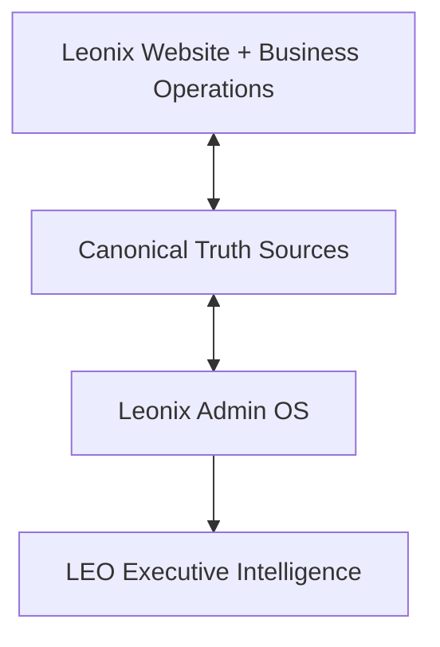

# LEONIX ADMIN OS — MASTER OPERATING BOOK

**Document role:** Canonical product/operations contract for the Leonix Admin OS launch-certification pass.  
**Primary audience:** Owner/CEO, Claude implementation agent, future LEO integration work.  
**Status:** Locked operating doctrine + current verified repository baseline + required cable-mapping contract.  
**Purpose:** Make the Leonix Admin the complete, reliable, understandable control plane for the company and make LEO a reader of that same canonical truth.

---

# 0. READ THIS FIRST

This project is **not a new-feature build**.

Leonix is treated as functionally feature-complete for this pass. The job now is to trace, organize, reconcile, repair, verify, and certify what already exists so the owner can launch and operate the company from Admin without needing to remember hidden routes, inspect Supabase manually, open code for normal business operations, or discover broken wiring only after a customer complains.

The core analogy is an **organized network rack**:

- The Leonix website, marketplace, staff tools, customer tools, revenue tools, content systems, moderation systems, analytics, and integrations are the cables.
- Canonical data sources and services are the wiring.
- Admin is the patch panel and control board.
- LEO is the intelligent operator who reads the labeled rack, understands the company state, and tells the owner what matters.

The goal is not to cut working wires or rebuild the rack. The goal is to know exactly where every wire begins, where it ends, what it controls, whether it is tangled with another wire, whether it is split incorrectly, whether it is mislabeled, and whether it is actually working.

---

# 1. LAUNCH-TOMORROW STANDARD

Assume Leonix launches tomorrow.

The owner must be able to operate Leonix from Admin as a one-person company without relying on memory of route architecture or code internals.

The launch test is:

> Can the owner understand, control, investigate, and act on the meaningful state of the Leonix company from Admin, with clear truth, clear ownership, clear actions, and clear failure states?

Admin must function as the control plane for all of these operational domains:

1. COMMAND
2. REVENUE
3. MARKETPLACE OPS
4. PEOPLE
5. WEBSITE
6. SYSTEM

These domains are organizational ownership boundaries, not excuses to fragment truth.

Every meaningful existing Leonix capability must have an appropriate relationship to Admin. Not every public feature requires an editor, but every operationally significant capability must be visible, controllable, searchable, explainable, auditable, or monitorable where appropriate.

Nothing operationally important should be orphaned on either side.

---

# 2. THE COMPANY BOOK MODEL

Admin is the **Leonix company operating book**.

LEO will later read this book.

The hierarchy is:

```text
LEONIX COMPANY
    ↓
OPERATING DOMAIN
    ↓
SYSTEM / MODULE
    ↓
ENTITY
    ↓
RECORD
    ↓
EVENT / EVIDENCE
```

The owner should not need to know where the raw record lives.

Example:

```text
LA TAQUIZA
    ↓
Canonical Leonix Business Identity
    ├── Customer / contacts
    ├── Business Concierge relationship
    ├── Listings / ads
    ├── Packages / entitlements
    ├── Contracts
    ├── Payments
    ├── Publication state
    ├── Moderation / reports
    ├── Magazine placements
    ├── Support cases
    ├── Notes / follow-ups
    ├── Analytics
    └── Audit history
```

If the owner says:

> "LEO, La Taquiza called and says their ad isn't working."

LEO must eventually be able to locate La Taquiza through canonical identity and determine, from real evidence, whether the problem is:

- payment failed
- entitlement inactive
- listing unpublished
- listing expired
- moderation hold
- reports/complaints
- category/publication blocker
- failed edit/republish
- missing asset
- customer/support issue
- provider/system failure
- or another known state

LEO must not guess.

---

# 3. THE FOUR-LAYER ARCHITECTURE



## Layer 1 — Leonix product and company
The actual public site, marketplace categories, Business Concierge, advertising, magazine, Tienda, support, staff operations, payments, analytics, and all other current business capabilities.

## Layer 2 — Canonical truth
Supabase tables, canonical IDs, server services, provider APIs, configuration, server actions, read models, and audit records that define what is actually true.

## Layer 3 — Admin OS
The owner/staff control plane. Admin must surface canonical truth, make the right actions available, provide understandable failure states, and route the owner to the correct operational context.

## Layer 4 — LEO
LEO reads the same canonical Admin truth. LEO should not scrape the dashboard, duplicate counts, invent a second business model, or build parallel logic for the same operational fact.

---

# 4. GLOBAL ADMIN OWNERSHIP MODEL

Every meaningful operational system should have **one primary Admin home**.

Contextual shortcuts and deep links are allowed.

Duplicate primary ownership is not.

## COMMAND
Primary purpose: what matters now.

Includes:
- LEO entry
- Command Center
- Today's Attention
- executive summaries
- priority engine
- global search / company lookup
- operational alerts
- executive reports
- "Handle now / Handle today / Can wait / Informational"

## REVENUE
Primary purpose: money and commercial lifecycle.

Includes:
- leads
- media kit inquiries
- promotional / print quote leads
- advertising opportunities
- packages
- entitlements
- payments
- promo codes
- contracts
- sales tracker
- Tienda revenue/order operations
- renewals
- failed/pending payments
- commercial Business Concierge handoff

## MARKETPLACE OPS
Primary purpose: all marketplace/public listing operations.

Includes:
- categories
- listings
- moderation
- reports
- expiration
- visibility
- featured/verified
- public listing health
- category-specific operations
- travel/Viajes operational surfaces
- Recursos where it functions as marketplace/community data
- Tienda where it functions as marketplace/catalog operations

## PEOPLE
Primary purpose: people, customers, businesses, staff, support.

Includes:
- Leonix businesses
- customer/business 360
- users
- Business Concierge
- support
- team/staff
- permissions
- assignments
- notes
- follow-ups
- meeting outcomes
- customer lifecycle

## WEBSITE
Primary purpose: public-site/content control.

Includes:
- Home
- Revista
- Noticias
- Iglesias
- Recursos content where applicable
- Clasificados landing/content
- Tienda storefront
- Nosotros
- Contacto
- Anúnciate
- global site settings
- site sections
- language/content QA
- banners/announcements/settings where real

## SYSTEM
Primary purpose: health, governance, integrations, proof.

Includes:
- activity/audit log
- permissions/governance
- system health
- integration/provider readiness
- Supabase availability
- environment/config readiness
- failed jobs/operations
- alerting
- language/system audits
- unavailable dependency states

---

# 5. OPERATOR TRUTH CONTRACT

Every actionable issue shown to the owner must answer these seven questions from persisted evidence where available:

1. **WHAT happened?**
2. **WHY is this in the attention queue?**
3. **WHAT triggered it?**
4. **WHAT evidence supports it?**
5. **HOW serious is it?**
6. **WHAT is the recommended solution / next action?**
7. **WHAT happens if I do nothing, when knowable?**

If provenance is missing:

```text
STATUS: NEEDS_TRIAGE
CAUSE: Unknown
EVIDENCE: Missing or insufficient
RECOMMENDED ACTION: Investigate the canonical source
```

Do not fabricate a cause merely to make the UI look complete.

---

# 6. TRUTH-STATE CONTRACT

Use these states consistently:

## REAL
A real data source exists and a real working code path is present.

## PARTIAL
A real capability exists, but the operational loop is incomplete.

## NEEDS_PROOF
Code appears to support the capability, but runtime/schema/provider proof is not currently available.

## BROKEN
An expected existing capability is demonstrably broken.

## UNAVAILABLE
A required provider/source is unavailable in the current environment.

## PLANNED
Only use when repository evidence proves something is genuinely designed but not implemented.

Never collapse unavailable, unknown, or unreadable data into zero.

---

# 7. ACTION / CTA CONTRACT

Every important CTA must have a complete action truth chain:

```text
SOURCE PAGE
    ↓
CANONICAL ENTITY / ID
    ↓
DESTINATION OR ACTION
    ↓
SERVICE / SERVER ACTION / API
    ↓
AUTHORIZATION
    ↓
WRITE OR NAVIGATION RESULT
    ↓
SUCCESS FEEDBACK
    ↓
FAILURE FEEDBACK
    ↓
AUDIT / RECEIPT WHEN APPROPRIATE
```

Classify every important CTA as:

- WORKS
- PARTIAL
- BROKEN
- WRONG_DESTINATION
- DUPLICATE
- HONESTLY_DISABLED
- NEEDS_PROVIDER
- NEEDS_DATA

## Before-action vs after-action
- Tooltip/helper = what the action will do before the owner clicks.
- Confirmation = required for dangerous/high-impact actions.
- Toast/result/receipt = what actually happened after the action.

## Raw technical errors are not an acceptable operator experience
The owner should not learn about missing Supabase objects, provider config, or environment variables by clicking a random button and seeing an implementation error.

Instead Admin should surface a meaningful owner-facing state.

Example:

```text
Unable to load payment status.
Stripe connection is unavailable in this environment.
Recommended action: System → Integrations.
```

System Health should surface the dependency before the owner discovers it randomly.

---

# 8. GOVERNANCE / ACTION SAFETY

## GREEN — safe read/analysis
LEO/Admin may:
- read
- search
- analyze
- filter
- summarize
- navigate
- prioritize
- present

## YELLOW — reversible preparation
May:
- draft
- prepare
- stage
- assemble suggested actions
- create reversible internal work where authorized

## RED — protected owner-impacting actions
Requires owner approval and correct authorization:

- delete
- publish/unpublish where customer-impacting
- money movement
- pricing changes
- contract execution
- staff permission changes
- irreversible customer-impacting changes
- external sends when not explicitly approved
- production release

AI moderation remains advisory. Human final decision remains authoritative.

---

# 9. CANONICAL ENTITY RELATIONSHIPS

Where they exist, Admin and LEO should use canonical identifiers and persisted relationships.

Examples of canonical entity classes that may exist in current systems:

```text
BUSINESS_ID
CUSTOMER_ID
PROFILE_ID
LISTING_ID
LEAD_ID
ORDER_ID
PAYMENT_ID
ENTITLEMENT_ID
CONTRACT_ID
REPORT_ID
SUPPORT_CASE_ID
MODERATION_REVIEW_ID
MAGAZINE_ISSUE_ID
STAFF_ID
AUDIT_EVENT_ID
```

The exact current schema must be verified in the repository/database before assuming specific names.

The operational goal is:

> one business context can connect all of the records that belong to that relationship.

Do not infer relationships from names when canonical IDs already exist.

If a relationship is missing, record that as a real cable gap.

---

# 10. WEBSITE ↔ ADMIN CROSS-REFERENCE RULE

The Admin certification must work in both directions.

## Direction A — Public/Product → Admin
For every public feature or business workflow:

> Where is its Admin wire?

Questions:
- Can Admin see it?
- Can Admin control what should be controllable?
- Can Admin understand its state?
- Can Admin locate its records?
- Can Admin inspect its failures?
- Can Admin view analytics where supported?
- Can Admin see reports/moderation where supported?
- Can Admin see payment/entitlement where applicable?
- Can Admin see audit history where applicable?
- Can LEO later read the canonical truth?

## Direction B — Admin → Product/Business
For every Admin card, tab, CTA, metric, report, or control:

> What real system does this operate?

Questions:
- What table/service/provider owns the truth?
- Is the count canonical?
- Is it a proxy?
- Is it duplicated elsewhere?
- Does the CTA operate the correct entity?
- Is the route legacy?
- Is there a newer canonical destination?
- Is the label truthful?

No orphaned controls.
No orphaned public features.

---

# 11. VERIFIED CURRENT REPOSITORY BASELINE

This section records facts already proven from current repository evidence at the Admin OS base commit.

## 11.1 Six Admin OS groups already exist
The current `adminGlobalNav.ts` defines:

- command
- revenue
- marketplace-ops
- people
- website-control
- system

This is aligned with the operating model in this document.

## 11.2 Current primary nav contains real destinations including
- `/admin/leo`
- `/admin`
- `/admin/businesses`
- `/admin/leads/inbox`
- `/admin/workspace/clasificados`
- `/admin/ops`
- `/admin/workspace/payment-tracker`
- `/admin/team/roster`
- `/admin/usuarios`
- `/admin/support`
- `/admin/workspace`
- `/admin/site-settings`
- `/admin/clasificados/viajes`
- `/admin/activity-log`
- `/admin/settings`
- `/admin/workspace/language-audit`
- `/admin/tienda`
- `/admin/recursos`

The current nav source itself documents some compatibility/legacy route decisions, including the old `/admin/payments` compatibility route and active path aliases around category/revenue tools.

## 11.3 Existing audit evidence says the strongest real areas include
- executive Command Center
- launch leads
- classifieds operations
- reports
- users
- support tickets
- staff roster
- Tienda
- promo/package/payment trackers
- site section editing
- magazine issue lifecycle
- activity log
- several admin API mutation routes

## 11.4 Existing audit evidence also identified known architectural confusion
- overlapping Viajes routes
- Website Control split across multiple route families
- duplicate Magazine route families
- Revenue tools distributed across multiple trackers/pages
- some pages acting as aliases, planning surfaces, or partial read models

## 11.5 Current repository evidence already shows newer additions
The current nav includes `/admin/recursos`, explicitly described in code as "Recursos Data OS".

The repository baseline also contains Website/Admin workspace support for Iglesias and Noticias in earlier Admin audits. These newer/expanded systems must be verified against current code, not assumed complete from historical docs alone.

---

# 12. CURRENT ADMIN OS WORKTREE STATE

Canonical worktree for this pass:

```text
C:\projects\elaguila-website\.claude\worktrees\admin-os+canonical-truth-2026-09
```

Branch:

```text
worktree-admin-os+canonical-truth-2026-09
```

Starting/base HEAD:

```text
a0a4783971b42ea1d71ab2602d4720d0d590baf8
```

Rules:
- do not create another worktree for this Admin OS pass
- do not move this work into a top-level sibling folder
- do not touch LEO worktrees
- do not touch unrelated worktrees
- do not push until the owner explicitly approves
- preserve existing uncommitted Admin OS work

Current known uncommitted Admin OS changes were reported in:
- `app/admin/_components/AdminCommandCenterDashboard.tsx`
- `app/admin/_lib/adminDashboardData.ts`
- `app/admin/_lib/adminReviewFlagTruth.ts`
- `docs/admin-os/`

---

# 13. CURRENT IMPLEMENTATION STATE FROM THIS PASS

## Phase 1 — Attention Truth
Partial.

A real double-counting bug was found in Command Center review attention.

The old logic added:

```text
raw pending/flagged listings count
+
a merged review queue preview that already included overlapping listings
```

This could count the same listing more than once.

The new direction uses canonical unique review attention rather than summing overlapping sources.

"Reports & complaints" was also reframed as "Report submissions" so raw report rows are evidence, not a second attention total.

Still required:
- trace remaining priority metrics to canonical sources
- prove support/payment/publication-blocker provenance
- remove any remaining duplicate/proxy truth

## Phase 2 — Moderation Truth
Partial.

Existing real AI moderation infrastructure was found:
- `listing_moderation_reviews`
- `classifyAdminReviewFlagTruth()`

A real defect was found where fetched AI moderation data was not being carried through correctly into dashboard classification.

`needsTriage` was added as an explicit truth state.

Still required:
- full source taxonomy
- CATEGORY_RULE source class if repository evidence supports it
- per-item evidence surface
- lifecycle/resolution model
- clear separation between listing risk and action impact
- no status-only flag should appear as proven high risk without evidence

## Phases 3+
Do not assume started unless progress files prove otherwise.

---

# 14. MODERATION OPERATING CONTRACT

Every moderation/review item should expose, where supported:

- entity/listing
- source
- reason
- evidence
- age
- severity/risk
- current case state
- recommended action
- seller/business context
- reports
- AI moderation result
- human decision
- audit history

Suggested case lifecycle:

```text
OPEN
→ TRIAGE
→ INVESTIGATING
→ AWAITING SELLER
→ ACTION REQUIRED
→ RESOLVED
```

A resolved case should leave the active queue.

A new signal occurring after resolution may reopen the case if repository/schema design supports that safely.

Source classes should distinguish where truth came from, such as:
- human report
- AI review
- status flag
- deterministic/category rule
- staff action
- legacy/unknown

Missing provenance must become NEEDS_TRIAGE, not invented certainty.

---

# 15. PRIORITY ENGINE CONTRACT

Priority is not "whatever appears first in the database."

Priority should derive from real operational factors, including where supported:

- age
- due date
- overdue state
- money/revenue impact
- customer waiting
- trust/safety impact
- launch blocker
- publication blocker
- manual escalation
- support severity
- failed payment
- expiration window
- system outage/degradation

Allowed owner-facing classes:

```text
CRITICAL
HIGH
MEDIUM
LOW
INFORMATIONAL
```

The Command Center presentation should roll these into:

```text
HANDLE NOW
HANDLE TODAY
CAN WAIT
INFORMATIONAL
```

The owner must be able to understand why each item is there.

---

# 16. CUSTOMER / BUSINESS 360 CONTRACT

A one-person company cannot operate from disconnected records.

Admin needs a canonical business/customer context where the existing schema allows it.

The Business 360 view should eventually be able to surface:

```text
IDENTITY
CONTACTS
BUSINESS STATUS
BUSINESS CONCIERGE STAGE
LISTINGS / ADS
PACKAGES / ENTITLEMENTS
PAYMENTS
CONTRACTS
PUBLICATION STATE
MODERATION / REPORTS
MAGAZINE
SUPPORT
NOTES
FOLLOW-UPS
MEETINGS
ASSETS
CREATIVE STATUS
ANALYTICS
RENEWAL
AUDIT HISTORY
```

Not every item has to live on one giant page.

The requirement is relational truth and clean navigation.

Global Search and LEO should use this same relationship model.

---

# 17. GLOBAL SEARCH CONTRACT

Global Search is the company patch panel.

It should locate supported entities by real identifiers such as:
- business name
- customer/user name
- email
- phone
- canonical business ID
- listing ID
- order ID
- support case
- lead
- report
- other real searchable IDs where supported

Search should navigate to canonical Admin context, not a generic dead-end result.

Do not add fake search support for entity types that are not actually indexed.

---

# 18. WEBSITE CONTROL CONTRACT

Website Control is not merely "content editing."

It is the operational relationship between Admin and the public Leonix site.

Every major current public section should be checked for:
- public route
- content/data source
- publication state
- Admin ownership route
- edit capability where appropriate
- preview capability where appropriate
- language state
- analytics where supported
- public failure state
- audit trail where appropriate
- LEO read path

Current sections to cross-reference include at minimum:
- Home
- Clasificados
- Tienda
- Revista
- Noticias
- Iglesias
- Recursos
- Nosotros
- Contacto
- Anúnciate
- global site settings
- language controls

This list must be expanded from actual current repository discovery.

---

# 19. MARKETPLACE CONTROL CONTRACT

The marketplace audit must discover the current canonical category registry and all real category-specific verticals.

Known Leonix category families include examples such as:
- Servicios
- Restaurantes
- Empleos
- Rentas
- Bienes Raíces
- Autos
- En Venta / Varios
- Clases
- Comunidad
- Mascotas y Perdidos
- Busco / Se Busca
- Viajes
- Ofertas Locales

Do not treat this list as authoritative if the current registry differs.

For every category:
- public discovery route
- publish/application route
- canonical listing storage
- preview/edit lifecycle
- owner/business identity
- entitlement/payment behavior if applicable
- moderation/report path
- expiration
- visibility
- analytics
- Admin ops route
- category-specific actions
- public CTA behavior
- canonical listing ID
- status model

All category behavior must be mapped before claiming Marketplace Ops is launch-ready.

---

# 20. REVENUE CONTROL CONTRACT

The Revenue book must connect the full commercial lifecycle.

Questions Admin must answer:
- Who is a lead?
- What did they ask for?
- Has anyone replied?
- What is the next action?
- Is there a quote?
- Is there an advertising package?
- Is there an entitlement?
- Is there a contract?
- Is payment pending/failed/complete?
- Is the ad ready to publish?
- Is anything blocked by money?
- Is a renewal approaching?
- Is there a promo/discount applied?
- Is Tienda involved?

Where provider truth is external, Admin must label what is known vs provider-dependent.

Never represent payment success if only a local intent exists.

---

# 21. PEOPLE / STAFF / SUPPORT CONTRACT

Admin must let the owner understand:
- users
- customers
- businesses
- staff
- team members
- assignments
- permissions
- support cases
- notes
- follow-ups
- who owns the next action
- overdue follow-ups
- customer waiting state
- last interaction
- current stage
- business relationship

Support must not become a disconnected ticket list.

Where possible, support should link directly to:
- user/customer
- business
- listing/ad
- payment/order
- report/moderation case
- Business Concierge record

---

# 22. SYSTEM HEALTH CONTRACT

Admin must not make the owner discover system configuration failures through random buttons.

System Health should report real, detectable health for:
- Supabase/data availability
- critical table/schema availability
- external providers
- payment provider connectivity
- email/SMS integrations where present
- background jobs where present
- critical API failures where observable
- audit pipeline
- required environment/config availability where safely detectable

Never expose secret values.

System Health may report:
- healthy
- degraded
- unavailable
- needs proof

If a dependency cannot be detected reliably, do not fake a green status.

---

# 23. LEO CONTRACT

LEO is not implemented by this document.

This document defines the future contract.

LEO must consume the same canonical truth Admin uses.

## LEO_NAVIGATION
May identify and open the correct Admin destination.

## LEO_READ
May read canonical operational truth.

## LEO_PRESENT
May summarize, explain, compare, prioritize, and brief the owner.

## LEO_PREPARE
May draft or stage reversible work where supported.

## LEO_EXECUTE_REQUIRES_APPROVAL
May only execute protected actions after proper owner approval and authorization.

## LEO_FORBIDDEN
Must not autonomously:
- delete important customer/business data
- move money
- change pricing
- execute contracts
- change permissions
- publish destructive/customer-impacting changes
- release production
- invent missing evidence
- create a second truth model

---

# 24. DAILY OWNER QUESTIONS THE SYSTEM MUST EVENTUALLY ANSWER

These are launch-certification scenarios, not just examples.

```text
Who needs me right now?
Who has been waiting too long?
Who has no next action?
What payments failed?
What money is at risk?
What ads/listings are blocked?
Why is this listing not live?
Which listings expire this week?
What was reported?
What did AI flag and why?
What did a human decide?
Which clients need follow-up?
Which contracts/payments are incomplete?
What is ready to publish?
What support case is unresolved?
What changed today?
What broke overnight?
Which system is unhealthy?
What cannot wait?
What can wait?
```

Business-specific example:

```text
LEO, La Taquiza says their ad is not working.
```

Expected resolution path:

```text
Find canonical business
→ find listing/ad
→ payment/entitlement
→ publication state
→ moderation/reports
→ expiration
→ recent audit/failure
→ explain cause
→ show evidence
→ recommend action
→ navigate to correct Admin control
```

---

# 25. 30-CLIENT SCALE TEST

The Admin OS must be tested as if Leonix had at least 30 simultaneous active client relationships.

For each client, determine whether Admin can reliably represent:

```text
owner
business
status
stage
last interaction
next action
due date
follow-up
notes
assets
creative
quote
contract
payment
publication
support
renewal
```

Classify each field:

```text
TRUE
PARTIAL
FALSE
NOT APPLICABLE
```

Any field that requires the owner's memory instead of persisted company truth is an operational gap.

---

# 26. CABLE MAP — REQUIRED TECHNICAL SCHEMA

The detailed technical map lives in:

```text
docs/admin-os/ADMIN_OS_CABLE_MAP.md
```

Every discovered system/module should record:

```text
SYSTEM
DOMAIN
PUBLIC_OR_BUSINESS_PURPOSE
PUBLIC_ROUTE_OR_ENTRY
PRIMARY_COMPONENT
CANONICAL_ENTITY
CANONICAL_ID
CANONICAL_DATA_SOURCE
READ_SERVICE
WRITE_SERVICE_OR_SERVER_ACTION
API_ROUTE_IF_ANY
PRIMARY_ADMIN_ROUTE
ALTERNATE_ADMIN_ENTRY_POINTS
ADMIN_READ_CAPABILITY
ADMIN_WRITE_CAPABILITY
GLOBAL_SEARCH_SUPPORT
CUSTOMER_OR_BUSINESS_CONTEXT_LINK
PAYMENT_OR_ENTITLEMENT_LINK_IF_APPLICABLE
MODERATION_OR_REPORT_LINK_IF_APPLICABLE
ANALYTICS_LINK_IF_APPLICABLE
AUDIT_LINK
LEO_SAFE_READ_SOURCE
CTA_DESTINATIONS
CURRENT_TRUTH_STATUS
KNOWN_DUPLICATION
KNOWN_BROKEN_OR_SPLIT_WIRING
MISSING_ADMIN_CONTROL
MISSING_RELATIONSHIP
NOTES
```

The Cable Map is the electrician's schematic.

This Master Operating Book is the company operating contract.

---

# 27. PERSISTENT STATE FILES

Claude should treat these as canonical project state:

```text
docs/admin-os/LEONIX_ADMIN_OS_MASTER_OPERATING_BOOK.md
docs/admin-os/ADMIN_OS_CABLE_MAP.md
docs/admin-os/ADMIN_OS_PROGRESS.md
docs/admin-os/ADMIN_OS_TESTS.json
```

Meaning:

- **MASTER OPERATING BOOK** = expected company behavior and launch contract
- **CABLE MAP** = current repository wiring and gaps
- **PROGRESS** = current phase/bookmark
- **TESTS** = what has actually been proven

Conversation history is not the primary project memory.

---

# 28. CLAUDE CONTEXT / COMPACTION PROTOCOL

This project may span multiple Claude context windows.

When context becomes large:

1. Persist all new facts to the four state files.
2. Do not leave important conclusions only in chat.
3. Allow compaction or restart.
4. Resume by reading the state files and git state.
5. Continue from CURRENT_PHASE / NEXT_ACTION.

Resume instruction:

```text
Read first:

docs/admin-os/LEONIX_ADMIN_OS_MASTER_OPERATING_BOOK.md
docs/admin-os/ADMIN_OS_CABLE_MAP.md
docs/admin-os/ADMIN_OS_PROGRESS.md
docs/admin-os/ADMIN_OS_TESTS.json

Then inspect:
- pwd
- git status
- recent git log

The Master Operating Book defines expected Leonix behavior.
The Cable Map defines current repository wiring.
The Progress file defines current work.
The Tests file defines proven behavior.

Do not reconstruct the project from conversation history.
Resume the recorded current phase.
```

---

# 29. EXECUTION SEQUENCE

The correct order is:

```text
CURRENT REPO
    ↓
FULL CABLE TRACE
    ↓
ADMIN_OS_CABLE_MAP.md
    ↓
BUILT vs EXPECTED vs GAP
    ↓
ORDERED REPAIR PLAN
    ↓
SURGICAL REPAIRS
    ↓
CTA / TRUTH / RELATIONSHIP CERTIFICATION
    ↓
30-CLIENT TEST
    ↓
LAUNCH CERTIFICATION
    ↓
LEO INTEGRATION
```

Do not skip the cable-map gate.

Do not restart broad auditing after the map is complete unless new code materially changes the architecture.

---

# 30. BUILT / EXPECTED / GAP FORMAT

For every major system, record three different kinds of truth.

## BUILT
What current repository/runtime evidence proves exists.

## EXPECTED
What this Operating Book says launch behavior must be.

## GAP
The difference.

Example:

```text
SYSTEM: Recursos

BUILT:
Public Recursos system exists.
Current Admin route exists.
Current repository data/control wiring = [fill from verified code].

EXPECTED:
Owner can understand and operate all operational Recursos behavior from Admin.
LEO can read its canonical state.

GAP:
[fill only from verified evidence]

ACTION:
[ordered repair]
```

This prevents the project from confusing "desired behavior" with "already implemented behavior."

---

# 31. REPAIR DOCTRINE

Once the cable map is complete:

- preserve proven working behavior
- prefer canonicalization over replacement
- prefer reusable global services where they already fit
- preserve category-specific adapters where required
- fix split truth before redesigning presentation
- fix broken routes/IDs before styling
- fix raw errors before cosmetic polish
- preserve deep links through redirects/aliases when appropriate
- do not delete a legacy route until callers are proven and a safe destination exists
- do not create speculative abstractions
- do not add new product features unless the audit proves a launch-critical capability is genuinely missing

---

# 32. FINAL LAUNCH CERTIFICATION

The Admin OS is launch-ready only when:

1. The current public website/product is cross-referenced against Admin.
2. The current Admin is cross-referenced against real product/company systems.
3. Major operational systems have canonical truth sources.
4. Every major system has one primary Admin operational home or an explicitly recorded external dependency.
5. Duplicate/split/tangled truth paths are reconciled.
6. Important CTAs work or are honestly disabled/labeled.
7. No critical operator flow exposes raw implementation errors.
8. Customer/business relationships can be navigated through canonical IDs where supported.
9. Newer systems such as Recursos/Iglesias/Noticias are included in the operating book.
10. Moderation/report/payment/expiration/support states explain why they matter and what to do.
11. System Health surfaces real detectable dependency failures.
12. 30-client simulation does not require owner memory for critical operational state.
13. LEO has a clear read/navigation contract to the same canonical truth.
14. Production build/typecheck/lint/targeted verification are green except explicitly documented pre-existing unrelated failures.
15. Remaining gaps are genuine external blockers, irreversible production decisions requiring owner approval, unavailable providers, or unresolved business decisions.

Final verdict must be one of:

```text
READY_FOR_LEO_INTEGRATION
NOT_READY_FOR_LEO_INTEGRATION
```

No "almost done."

---

# 33. INITIAL CABLE-MAPPING DIRECTIVE FOR CLAUDE

Claude should now use this document as the operating contract and execute the current-repository mapping pass.

Required first actions:

```text
1. Confirm current worktree and branch.
2. Read this Master Operating Book.
3. Read ADMIN_OS_PROGRESS.md.
4. Read ADMIN_OS_TESTS.json.
5. Inspect current uncommitted Phase 1/2 changes.
6. Create/update ADMIN_OS_CABLE_MAP.md.
7. Cross-reference current public/product routes against Admin.
8. Cross-reference current Admin controls against real product/company systems.
9. Record BUILT / EXPECTED / GAP.
10. Produce an ordered repair plan.
```

Do not begin broad repair implementation until the map is sufficiently complete to prevent duplicate work and accidental rewiring.

---

# 34. OWNER INTENT — LOCKED

The owner's intent is:

> Leonix already has a strong Admin built over months of work. The current task is to make sure absolutely everything that should be there is there, every important connection works, every tab explains its whole operational domain clearly, every CTA goes somewhere meaningful and works, every failure is understandable, every public/business feature has the correct Admin relationship, and every customer/business/system fact can later be located and read by LEO.

The end state is not "a better dashboard."

The end state is:

> **A clean, launch-ready Leonix company operating system with Admin as the book of record and LEO as the intelligent reader of that book.**
